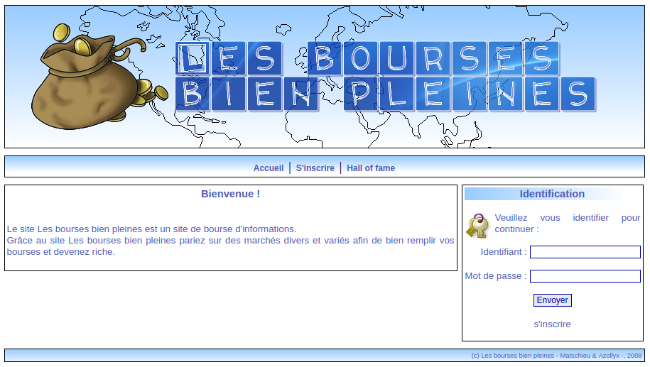
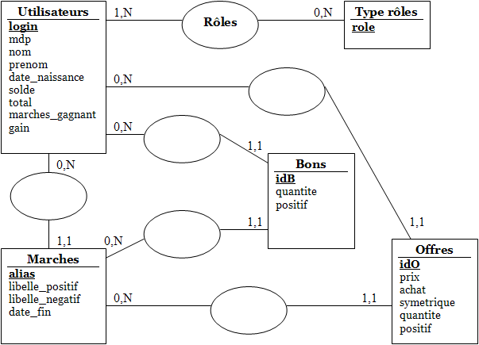
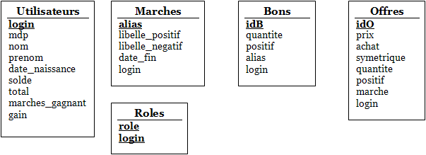

Projet de base de données\
Site web de bourse d'informations
==============

**Author: Matschieu, Azollyx**\
**DUT informatique, 2007-2008**



# Description du projet

Lors de ce projet, l’objectif fixé est de réaliser un site web de bourse d’informations. Un tel site permet à des personnes, inscrites en tant que joueur, de parier sur des marchés mis en place par des personnes ayant ce droit.

Plus concrètement, un marché est une information qui sera vérifiée ou démentie dans le futur. Il est composé de l’information et de sa négation (par exemple "nous aurons 20 en projet de BDD" et "nous n’aurons pas 20 en projet de BDD") et possède une date de fin après laquelle le marché sera clôturé.
Chaque personne inscrite en tant que joueur peut participer à un marché, c'est-à-dire acheter un nombre de bons choisi à différents prix (inférieur à 100 crédits pour un bon) soit en faveur du marché soit en faveur de sa négation. Lorsqu’un joueur achète n des bons à x crédits pour une information, automatiquement n bons à 100 – x euros sont mis en vente sur l’information contraire et vice versa. Si les bons sur l’information contraire sont achetés, il y a alors poignée de main entre deux personnes, sinon on attend un acheteur.
Dès lors qu’un joueur passe un ordre d’achat, son compte (initialisé à 2000 crédits lors de l’inscription) est crédité du prix des bons. Lorsque la date de fin d’un marché est atteinte, les joueurs ayant acheté des bons gagnants se voient offrir 100 crédits par bon par la banque. Les bons perdant ne rapportent rien. Par contre si un joueur avait acheté des bons et qu’aucune poignée de main n’a eu lieux, le prix d’achat des bons lui est remboursé.
Chaque joueur possède un portefeuille d’ordres contenant tous ses achats et ses ventes qu’il peut à tout moment annuler. On rappelle que si un joueur est ruiné, chaque jour la banque lui offre 50 bons sur une information et 50 sur son inverse dans un marché choisit par le joueur parmi trois tirés aléatoirement. 

# Travail effectué

La première partie du projet a été la phase d’analyse et de construction de la base de donnée, puisque tout le projet repose sur celle-ci.
Notre analyse nous a permis d’élaborer le MCD suivant :



En toute logique, le MLD obtenue est le suivant :



Par la suite, nous avons effectué quelques changements de noms de champs dans certaines tables, par exemple dans la table, login est devenu passeur.
La structure complète de la base de données utilisée pour notre projet est définie par le script de création des tables suivant : 

```
create table Utilisateurs (
	login varchar(20),
	mdp varchar(36) not null,
	nom varchar(30),
	prenom varchar(30),
	date_naissance date,
	solde integer,
	total_marches integer,
	marches_gagnant integer,
	gain integer,
	constraint PK_Utilisateurs primary key (login)
);
create table Roles (
	role char,
	login varchar(20),
	constraint PK_Roles primary key (role,login),
	foreign key (login) references Utilisateurs(login)
);
create table Marches (
	alias char(3),
	libelle_positif text,
	libelle_negatif text,
	date_fin date,
	createur varchar(20),
	constraint PK_Marches primary key (alias),
	foreign key (createur) references Utilisateurs(login)
);
create table Bons (
	idB serial,
	proprietaire varchar(20),
	quantite integer,
	marche char(3),
	positif boolean,
	constraint PK_Bons primary key (idB),
	foreign key (proprietaire) references Utilisateurs(login),
	foreign key (marche) references Marches(alias)
);
create table Offres (
	idO serial,
	passeur varchar(20),
	prix integer,
	achat boolean,
	symetrique boolean,
	quantite integer,
	marche char(3),
	positif boolean,
	constraint PK_Offres primary key (idO),
	foreign key (passeur) references Utilisateurs(login),
	foreign key (marche) references Marches(alias)
);
```

 Ce script a été utilisé avec PostgreSQL et MySQL et fonctionne parfaitement (il en est de même pour le site).
Une fois l’étape d’analyse terminée, nous avons pu nous lancer dans la programmation du site. Nous avons d’abord commencé par réaliser une classe singleton BourseInfo, permettant de récupérer une connexion vers la base de données, et une classe de génération de la page HTML (à noter que la page HTML utilise une feuille de styles), appelée HTMLCode.

Enfin nous avons entamé les pages utilisateurs. La première étape dans la réalisation des pages a été l’inscription au site et la connexion en tant qu’utilisateur/maker avec gestion des sessions afin de connaître le rôle de la personne et de l’aiguiller vers le bon menu, ou éventuellement la page de login si la connexion n’a pas eu lieu.
Ensuite il a fallu pouvoir créer un marché (maker uniquement) et afficher la liste des marchés puis finalement consulter un marché, y effectuer des achats/ventes et terminer un marché et pouvoir ajouter des makers (makers uniquement).

Dans la gestion des rôles, nous partons du principe qu’une personne s’inscrivant est simple participant et peut donc consulter, acheter et vendre. Un maker possède les mêmes droits qu’un simple participant mais peut également créer des marchés et ajouter des makers. Il est désormais possible de s’inscrire en tant que participant, de se connecter, de voir le classement des joueurs par gain, d’ajouter un market-maker, de consulter la liste des marchés et y effectuer des achats/ventes, créer un marché.
Le site utilise des sessions afin de gérer les droits des utilisateurs (maker ou simple participant) et d’afficher les informations adaptées. 

# Difficultés rencontrées lors du projet

La première difficulté rencontrée lors du projet a été la façon de générer le code HTML. En effet, nous avons dès le début souhaité pouvoir modifier simplement une partie de la structure logique de la page HTML (en dehors du CSS) sans pour autant devoir modifier toutes les pages déjà existantes.
Dans un premier temps nous nous sommes tournés vers les JSP afin de pouvoir inclure des en-têtes et des fins de page. Cependant nous nous sommes heurtés au problème lié à l’utilisation de singleton intervenant dans le projet (afin d’obtenir une connexion à la base et quelques informations globales au projet sous forme de constantes) et qu’il n’était pas possible d’utiliser avec les JSP.
Nous avons ensuite opté pour l’utilisation de servlet Java en utilisant une classe comportant des méthodes générant le HTML. Ainsi il est possible d’ajouter un bout de texte mis en forme dans une partie de la page bien précise (menu, milieu de la page…) et de récupérer tout le code de la page à la fin (toutes les parties bout à bout).
Ce système nous permet donc une meilleur évolubilité de la structure mais surtout permet de travailler à deux avec les mêmes éléments.

Une autre difficulté, aucunement liée aux technologies utilisées cette fois, fut la compréhension du sujet notamment sur le fonctionnement des achats/ventes de bons et la réalisation de l’algorithme permettant ces opérations. Ce qui est délicat sur ce point est de bien comprendre les actions à effectuer et la bonne marche à suivre contrairement au reste du projet qui est moins ambiguë bien qu’il comporte parfois de gros traitement.

Hormis ces deux points, le reste du projet n’a pas posé de difficultés majeures si ce n’est que nous aurions sans doutes du mieux nous organiser avant de se lancer dans la programmation du système. En effet nous avons parfois du modifier certaines classes communes à nos travaux, parfois en même temps, il aurait donc été préférable dès le début de définir de la meilleure manière possible les classes que nous aurions eu à utiliser simultanément ainsi que leurs méthodes.
Ceci nous a permit, à travers le projet, de nous montrer la difficulté du travail en équipe et les erreurs à éviter. 

# Améliorations possibles du système

Au niveau du code, nous n’avons pas géré le type d’affichage de la date. Nous utilisons l’affichage standard de l’objet java.sql.Date utilisé, c'est-à-dire sous la forme aaaa-mm-jj.
Le chargement du driver pour accéder à la base de données se passe dans la classe BourseInfo, pour simplifier le changement de driver (en cas de changement de système, ou de base de données), on pourrait envisager l’utilisation d’un fichier de configuration XML, ce qui simplifierait grandement la tâche et permettrait de ne pas avoir à recompiler la classe. Cette façon de faire éviterait aussi une technique que nous utilisons qui peut paraître un peu "brouillon" nous ayant permit de tester le site sur deux systèmes et bases différents (Windows avec MySQL via ODBC et Linux avec PostgreSQL) : 

```
if (System.getProperty("os.name").equals("Windows XP")) {
	driver = "sun.jdbc.odbc.JdbcOdbcDriver";
	url = "jdbc:odbc:myodbc";
	id = pwd = "";
}
if (System.getProperty("os.name").equals("Linux")) {
	driver = "org.postgresql.Driver";
	url = "jdbc:postgresql://sqlserv/2a";
	id = pwd = "";
}
```

 Enfin le site n’est pas particulièrement optimisé en terme de sécurité et il serait toujours possible de l’améliorer notamment en cryptant le mot de passe de l’utilisateur (algorithme de hachage) ou même en poussant un peu la gestion des paramètres passés aux pages.

L’utilisation de Java se résumé ici à l’utilisation de servlet et de l’API déjà existante permettant l’utilisation d’objets pour accéder à la base de données. Néanmoins, on pourrait envisager par la suite de revoir le code du site en développant plus le côté objet avec, par exemple, une classe Participant et une classe Maker…

En ce qui concerne l’utilisation du site, on pourrait envisager par la suite d’afficher les listes (marchés, utilisateurs, hall of fame…) sur plusieurs pages avec un certains nombre d’élément par page dans le cas ou la base de données commencerait à se remplir. On pourrait également améliorer la façon d’ajouter un market-maker en ayant par exemple une liste de nom avec des cases à cocher plutôt que de devoir entrer l’identifiant de la personne à chaque fois.

On pourrait envisager de rendre complètement compatible le site avec les normes XHTML du W3C puisque ce n’est pas tout à fait le cas pour le moment bien que nous essayons de nous en approcher.

La plupart de ces points n’ont pas été traité directement lors du projet afin de se concentrer principalement sur l’aspect "base de données" et "servlet" du site qui est, d’après nous, le sujet du projet. Néanmoins nous sommes donc tout à fait conscient des défaut de notre site et des améliorations à lui apporter (on devrait même pouvoir en trouver davantage en cherchant bien). 
