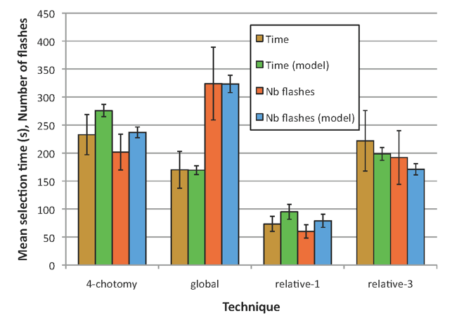

Rapport de Projet\
Interface d’optimisation du choix de couleurs
==============

**Author: Matschieu**\
**Master informatique, 2009-2010**

# Rappel du sujet

Lors de la spécification de graphiques dans certains logiciels (OpenOffice par exemple), les couleurs sont au choix de l’utilisateur qui va, logiquement, choisir plusieurs couleurs radicalement différentes afin de rendre le document lisible.
Cependant un problème se pose lorsque l’utilisateur souhaite imprimer son document comportant le graphique sur une imprimante non couleur. En effet, chaque couleur du graphique est convertit en niveau de gris et il se peut que pour des couleurs tout à fait différentes visuellement, leurs niveaux de gris respectifs soient égaux. La lisibilité du document est alors compromise puisqu’il est impossible de différencier les couleurs.
Bien entendu ce problème est vrai pour tout type de document ayant de la couleur, même sans graphique.

 

_Choix de couleurs ayant le même niveau de gris_

 

_Choix de couleurs de niveaux de gris différents_

Ce TP vise donc à réaliser une interface graphique indépendante et complémentaire à un logiciel tel que OpenOffice et permettant d’aider un utilisateur à choisir des couleurs différentes et ayant également des niveaux de gris différents pour palier à ce problème. Une fois les couleurs obtenues, l’utilisateur pourra, de manière simple, importer ses couleurs dans le logiciel concerné.

On rappelle que le niveau de gris d’une couleur est calculé grâce à la formule suivant :
```
NiveauGris = 0.3 * Rouge + 0.59 * Vert + 0.11 * Bleu
```

# Travail réalisé

L’interface réalisée propose deux méthodes pour obtenir des couleurs avec différents niveaux de gris :
* Génération automatique : l’utilisateur n’a qu’à renseigner le nombre de couleurs qu’il souhaite utiliser et l’application génère par elle-même n couleurs ayant différents niveaux de gris.
* Génération personnalisée : l’utilisateur choisi dès le départ certaines couleurs en les sélectionnant sur une palette ou en saisissant le code RVB puis l’application génère des couleurs de niveaux de gris différents en proposant des couleurs se rapprochant le plus de la couleur initiale.

Le choix de la méthode se fait dans la barre de menu ou via la barre d’outils (icônes). Ce sont les seuls choix possible pour l’utilisateur (en plus de quitter, aide ou à propos) ce qui rend simple l’utilisation de l’application.
Les étapes suivantes (saisie du nombre de couleurs ou choix de couleurs) ne présentent également aucune difficulté d’utilisation.
Dans un cas comme dans l’autre, pour un niveau de gris, plusieurs couleurs sont proposées et l’utilisateur peut sélectionner celle qu’il souhaite. Un aperçu de la couleur aide (ainsi qu’un aperçu de la couleur initiale si elle existe).
Le code RVB ainsi que le code hexadécimal de la couleur sélectionnée sont visibles dans des zones de texte et peuvent ensuite être déplacés vers un autre logiciel par drag and drop ou par copier coller (ctrl+c/ctrl + v).
Enfin, tous les cas d’erreur ont été traités et l’utilisateur est informé si nécessaire de cette erreur (erreur de saisie par exemple).

Remarque : 
* Un fichier build.xml est fourni pour pouvoir utiliser ant et compiler (ant compile), exécuter (ant run) ou encore créer un jar exécutable (ant jar).
* Le code source est documenté à l’aide de commentaires pour les parties les plus compliquées, mais pas sous forme de javadoc.
* Le modèle MVC n’a pas été utilisé ici, il n’y a pas de contrôleur. Ceci pourrait être un axe d’amélioration de l’application.

# Difficultés rencontrées

Plusieurs difficultés se sont posées lors de ce TP.

La première vient du fait que le problème de fond (le calcul des couleurs) est assez compliqué et se fait au détriment du problème de forme (l’IHM), qui est ici celui qui nous intéresse.
Ainsi la génération des couleurs de niveaux de gris différents est assez longue du fait d’un algorithme qui n’est pas du tout optimal : on parcourt toutes les couleurs possibles soient 256 *256 *256 possibilités.
De même lorsque l’utilisateur sélectionne des couleurs initiales, on voudrait que le programme choisisse la couleur la plus proche de la couleur initiale pour un niveau de gris. Malheureusement cette fonctionnalité ne fonctionne pas car la question suivante se pose : comment déterminer qu’une couleur est la plus proche d’une autre parmi un ensemble de couleur ?
Néanmoins, même si ces problèmes existent et mériteraient d’être résolus, je considère que l’IHM est plus importante et son fonctionnement n’est pas altéré par les problèmes cités précédemment.

# Utilisation du programme


_Interface à l’ouverture_

| Icônes | Signification |
| --- | --- |
|  | Générer des couleurs à partir d’une sélection de couleurs |
|  | Générer des couleurs automatiquement |
|  | Afficher un message d’aide (à quoi correspondent les deux méthodes de génération de couleurs) |
|  | Affiche l’auteur du programme |
|  | Quitter le programme |


_Affichage des couleurs générées_
