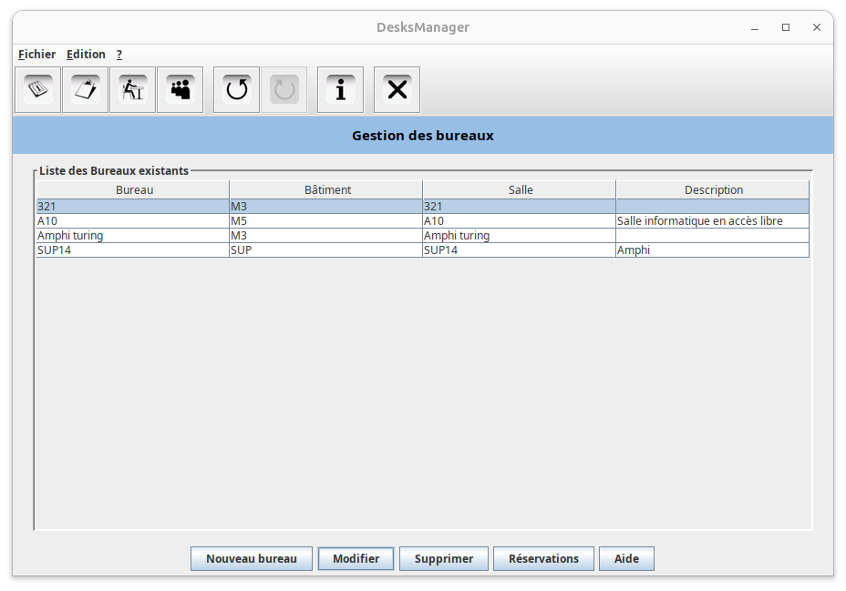

Rapport de Projet\
Interface de gestion d’attribution de bureaux
==============

**Author: Matschieu**\
**Master informatique, 2009-2010**

# Rappel du sujet

Lors de ce TP, on se propose de réaliser une interface de visualisation et de réservation de places de bureaux. Le but de cette interface est de permettre la gestion des bureaux au sein d’un laboratoire afin d’éviter l’attribution d’un bureau à plusieurs personnes (selon le sujet, des stagiaires) différentes au même moment.

# Choix effectués

## Unité de temps

Le choix a été fait de gérer les bureaux selon une unité de temps qui est la semaine. Une semaine est identifiée par son numéro dans l’année (52 semaines par année). Cependant, l’interface permet de voir les dates de début/fin d’une semaine donnée pour éviter les erreurs et se situer (info bulle sur le calendrier).

## Informations mémorisées

Il est possible de spécifier la salle dans laquelle se trouve un bureau lors de sa création, néanmoins, aucune gestion des salles n’est possible. Par contre, une gestion des personnes (stagiaire et personnel du laboratoire) est disponible.
On mémorise donc les personnes intervenant dans la réservation d’un bureau, les bureaux eux-mêmes et les réservations.

## Mémorisation et base de données

La base de données utilisée ici est en fait des fichiers XML. Il existe un fichier pour chaque donnée devant être mémorisée (à savoir les bureaux, les personnes et les réservations). Bien entendu, l’utilisation du modèle MVC permet de changer facilement le type de base de données utilisée, il suffit de créer une nouvelle classe effectuant les accès à cette base de données et qui hérite de l’interface desk.model.DataBase qui définit les méthodes nécessaires au fonctionnement du programme. Aucune autre modification ne doit être apportée au programme pour changer la base de données (excepté la création de l’instance de l’objet base).
Dans notre cas, nous avons une classe desk.model.XMLDataBase qui implémente desk.model.DataBase.
Au démarrage de l’application, il est nécessaire de disposer d’un répertoire xml/ contenant les fichiers XML et les DTD qui leurs sont associés. Si ce répertoire n’existe pas, alors il est créé au lancement du programme de même que les fichiers XML et DTD (par création de la base de données).

## Techniques implémentées

Conformément au sujet, deux techniques ont été implémentées :
* Undo/redo (annuler/refaire) : il est possible d’annuler ou de refaire une opération de création, modification ou suppression pour les utilisateurs, les bureaux et les réservations. Les combinaisons de touches "ctrl + z" et "ctrl + y" permettent respectivement d’annuler ou refaire. Ces opérations sont également disponibles via les menus ou la barre d’icônes.
* Copier/Coller : Il est possible de copier/coller une personne ou un bureau. Pour cela il suffit de sélectionner un élément dans la liste et utiliser les touches "c" et "p" pour respectivement copier et coller. Il est possible d’obtenir la méthode pour effectuer ceci via le bouton "aide" en bas de fenêtre.

## Architecture MVC et packages

Selon la consigne, une architecture MVC a été mise en place. Chaque élément, à savoir les modèles (base de données), les contrôleurs et les vues (IHM) sont réparties dans trois packages desk.model, desk.controller et desk.view. D’autres sous packages permettent d’organiser au mieux les classes. La représentation élémentaire des données se trouve dans desk.model.util, desk.model ne contient que la représentation de la base de données.
C’est cette architecture MVC qui permet de changer de base de donnée simplement.

## Gestion des erreurs

L’interface a été développée et testée pour gérer toutes les erreurs (Exception) pouvant être déclenchées. Si l’erreur est importante et influe sur la suite de l’exécution, l’utilisateur en est informé par un message dans une fenêtre d’erreur. Sinon le problème est correctement géré en fond et l’exécution continue.
Interface réalisée

# Interface réalisée

## Compilation et exécution du programme

Un fichier build.xml est fourni afin de pouvoir utiliser Ant pour compiler et exécuter le programme ou encore générer un fichier JAR exécutable.
Voici les commandes associées à ce fichier Ant :
* ant compile : permet de compiler le programme (place les .class dans le répertoire classes/)
* ant run : compile et exécute le programme
* ant jar : compile le programme et créer un JAR exécutable (l’utiliser avec java –jar <jar_file>)
* ant clean : nettoie les fichiers .class et .jar générés par Ant

Remarque : Les sources .java sont dans le répertoire src/ et la librairie utilisée pour la manipulation des fichiers XML (JDOM) se trouve dans lib/. Les icônes de l’application sont dans src/img/ (elles sont également copié dans classes/img/).

## Utilisation de l’interface

Bien entendu, l’interface a été développée pour être le simple possible à utiliser.
Les menus, icônes et raccourcis (touches F3 à F6)  permettent de naviguer entre les différentes parties du programme.
Sur certaines fenêtres popup utilisées pour la saisie des informations, la touche "entrée" permet de valider la saisie tandis que la touche "echap" permet d’annuler. Toutes les opérations possibles sont signalées par des boutons en bas de fenêtre.
Quelques raccourcis disponibles sur des tables existent (par exemple copier/coller). Pour les connaître, un bouton aide est disponible en bas de la fenêtre lorsqu’il en existe.
En cas de saisie, si des champs important ne sont pas renseignés, l’utilisateur est informé.

_Calendrier des semaines_

 

_Gestion des réservations_

 

_Gestion des bureaux (la gestion des personnes est identique)_
