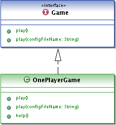
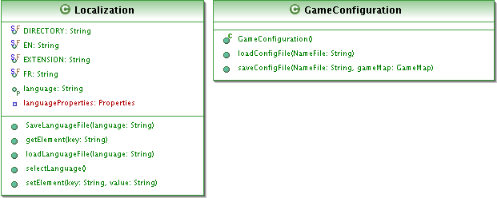
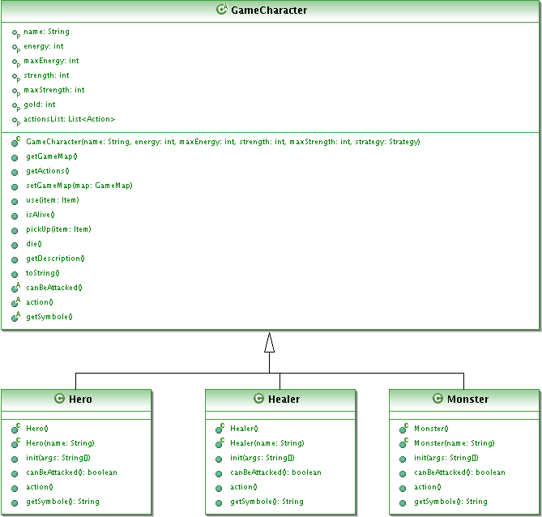
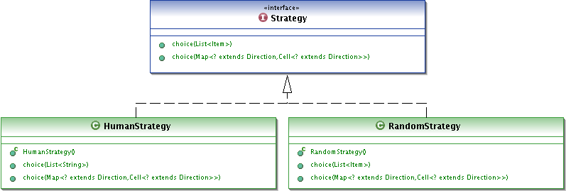
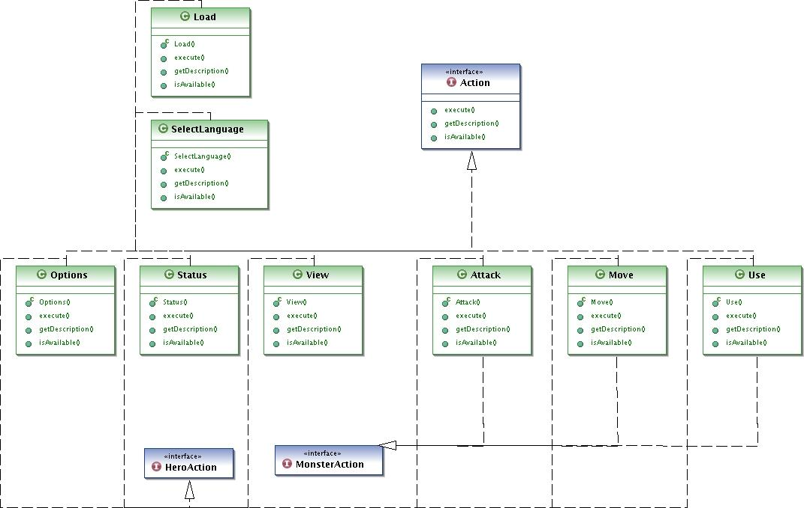
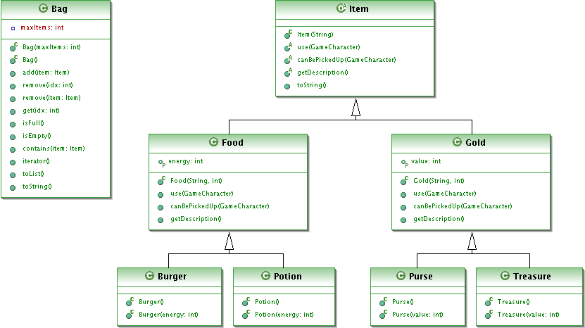
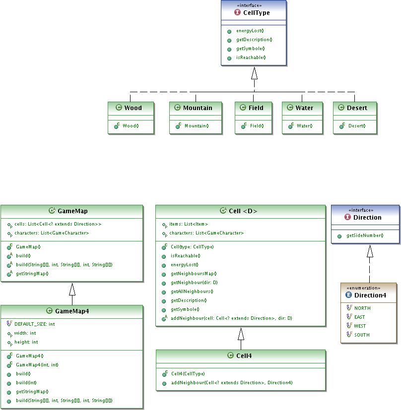

Rapport de Projet\
Développement d’un jeu d’aventure
==============

**Author: Matschieu**\
**Licence informatique, 2008-2009**

# Introduction

Le projet dont traite ce document a été réalisé dans le cadre de l’UE projet logiciel mise en place au semestre 6 de la licence informatique de l’université de Lille1.

Le but de ce projet, dont la durée s’étale sur un semestre entier, est de proposer aux étudiants de développer une application de taille conséquente en binôme. Contrairement à des programmes de travaux pratique, cette application nécessite de réfléchir à une conception (objet) robuste permettant son bon fonctionnement ainsi qu’une possibilité d’évolution future (principe d’ouverture/fermeture du code source).
C’est également un bon moyen de confronter les étudiants à de réelles difficultés de conception et/ou de développement faisant intervenir des connaissances acquises durant leurs années d’études et si nécessaire de nouvelles compétences.

Cette année, le sujet choisi pour ce projet est la réalisation d’un jeu d’aventure simpliste en mode texte (par ligne de commande) permettant de manipuler un personnage sur une carte en effectuant diverses actions.

Le langage utilisé pour ce projet est Java couplé à la gestion de fichiers XML permettant l’externalisation de données ainsi que l’utilisation d’outils tel que ant.

# 1. Le projet

## 1.1. Présentation générale du jeu

Durant ce projet, on se propose de réaliser un jeu d’aventure assez simple.
Ce jeu est constitué d’une carte elle-même constituée par des types de terrain pouvant être des champs, des montagnes, des plaines... L’aire de jeu est donc finie, c'est-à-dire qu’on en connaît les dimensions. Chaque type de terrain peut être traversé par un personnage cependant cela lui fait perdre une certaine quantité d’énergie en fonction du type de terrain traversé. Un terrain peut contenir aucun ou plusieurs personnages/objets.

Chaque personnage est caractérisé par sa force et son énergie (ses points de vie), une somme d’argent qu’il possède mais aussi par un sac contenant des objets. Un personnage, quel qu’il soit, va pouvoir effectuer plusieurs actions, parfois différentes selon le personnage.
Le joueur incarne un personnage spécifique, le héros, qu’il peut manipuler via une interface texte en choisissant les actions à effectuer.
Les autres personnages (les monstres et les guérisseurs), quand à eux, agissent de manières aléatoires.

Parmi les actions proposées, on a l’interaction avec un autre personnage se trouvant sur la même unité de terrain, c'est-à-dire une attaque en cas d’interaction avec un monstre ou la récupération de vie en échange d’argent en cas d’interaction avec un guérisseur. Il y a également la possibilité de se déplacer sur l’un des terrains voisins, observer les terrains qui entourent le personnage, ramasser ou utiliser un objet...
Un guérisseur ne fait rien à part guérir un personnage ayant assez d’argent tandis qu’un monstre se déplace sur la carte en plus de quelques actions listées précédemment.
Le héros quant à lui peut effectuer quelques actions qui lui sont spécifiques comme par exemple consulter son statut à un moment donné.

Lorsqu’un personnage en combat un autre, ce dernier perd autant d’énergie que la force de l’adversaire. Lorsqu’un personnage meurt, il laisse sur le terrain où il se trouvait tous les objets qu’il avait dans son sac ainsi que son argent sous la forme d’un objet ayant une valeur (un trésor, une bourse...). La valeur de cet objet sera ajoutée à la somme d’argent possédé par le personnage qui l’utilise.
Pour regagner de l’énergie, en plus de négocier avec un guérisseur, un personnage peut utiliser certains objets tels que de la nourriture.

Le jeu est organisé en tour. Chaque personnage ne peut effectuer qu’une seule action par tour (sauf par exemple si le héro consulte son statut). Le jeu continue tant que le héros est en vie, si il vient à mourir, le jeu se termine.

## 1.2. Contraintes

Dans la réalisation du projet, certaines contraintes ont été imposées comme par exemple l’écriture de la documentation du code produit (javadoc) et rédigée en anglais. Ceci permet de prendre conscience de l’importance de la documentation mais permet également au deux binômes ou à d’autres personnes de pouvoir savoir ce que fait un objet ou une méthode précise.

Une autre contrainte, importante également, se situe plutôt au niveau de la conception. En effet le code source doit respecter le principe ouvert/fermé, c'est-à-dire qu’il doit être facilement extensible et permettre une évolution le plus simplement possible (ouvert) mais il doit être conçu de manière à ne pas laisser un utilisateur faire des choses interdites (fermé). Par exemple, il devra être simple d’ajouter par la suite un nouveau personnage, un nouvel objet, un nouveau type de terrain ou encore une nouvelle action non prévu(e) lors du développement du jeu original.
Ceci impose donc de bien réfléchir à la manière dont sera construite l’application afin de ne pas être bloqué par la suite.
Pour tester cet aspect, une modification devra être apportée au jeu après un premier rendu du projet et avant le rendu final et la soutenance.

La gestion de fichier XML et properties a également été demandée afin de pouvoir être en mesure de lancer le jeu dans plusieurs langues différentes ou avec une configuration de base (les personnages utilisés et leur nombre...) définie dans un fichier.

Au niveau du jeu en lui-même, il est demandé d’implémenter une carte avec des terrains rectangulaires ayant de quatre voisins. Le code doit être indépendant de cela (possibilité d’extension). Le jeu doit être capable de s’exécuter en mode texte dans un terminal impérativement, un menu permettra au joueur de choisir les actions à effectuer.

## 1.3. Travail réellement réalisé

Notre projet est, dans sa version finale, capable de créer une aire de jeu (carrée et finie) sur laquelle sont placés des personnages et des objets. 
Cette carte utilise des éléments de terrains rectangulaires ayant quatre voisins et est torique (choix fait lors du développement). Il est cependant tout à fait possible de créer un autre type de terrain (ceci est développé plus loin dans ce document).
La création de la carte est soit définie dans un fichier de configuration contenant des informations sur les personnages (énergie, force, actions), les terrains utilisés et la taille de la carte... soit elle est entièrement aléatoire (sauf pour les dimensions déterminées par le programmeur). Ce dernier cas  qui signifie que le nombre de personnages, de types de terrain et d’objets ne sont pas fixes. 
Si on regarde plus en détail le jeu, le mode de fonctionnement décrit dans le sujet (la façon dont se déroule un combat...) est sensiblement le même.
Le jeu s’exécute en mode texte dans un terminal (pas d’interface graphique) et le joueur choisit ses actions à travers un menu dont la réponse est un numéro.

Au final, le cahier des charges a été complètement respecté et mis en œuvre. On peut cependant citer quelques améliorations ayant été ajoutées ou imaginées indépendamment du cahier des charges 

* Dans ce cas l’ajout d’un nouvel élément, par exemple un type de terrain, est très simple, il suffit d’ajouter une classe du type approprié dans le bon package, puisque les classes sont chargées dynamiquement. Cette méthode permet l’ajout de classes sans aucune modification de ce qui existe déjà.
Le principe du chargement dynamique de classe est également utilisé pour l’ajout d’actions à un personnage. Un personnage a une liste d’actions de base qui lui sont propres auxquelles s’ajoute de nouvelles actions détectées dans le package.
Pour plus d’information sur l’extension du code, veuillez vous référer à la partie appropriée de ce document.

* Tout le jeu a été développé dans la mesure du possible (certains cas on peut être été oubliés) comme un "framework" et utilise donc beaucoup d’interfaces, classes abstraites et classes génériques afin de permettre de créer un jeu différent à partir des classes existantes en étendant certaines classes si nécessaire. Il est donc possible de créer une carte dont chaque terrain à 3 voisins, créer une partie à 2 joueurs humains, etc...

* Un système de variable dans les fichiers XML de langue a été mis en place afin de pouvoir construire une chaîne avec des paramètres variables du programme (l’énergie ou le nom d’un personnage) sans tenir compte de l’ordre des mots dans une langue donnée. Ce système est développé dans la partie traitant de l’externalisation de paramètre de ce document.

* Bien entendu, de nombreuses actions non spécifiées dans le sujet ont été ajoutées.

## 1.4. Phases de développement

Les différentes phases de développement énoncées ci-dessous découlent d’une conception et de choix établis d’une part lors de séance de TD avec un enseignant et d’autre part lors de longues conversations entre binômes.

La première partie du développement de notre projet fut la réalisation de petits éléments du jeu tels que les personnages ou les objets. Ces éléments sont simple à mettre en place puisqu’ils sont tous représentés par des classes héritant d’un même interface/classe abstraite (chaque personnage hérite de la classe abstraite GameCharacter et chaque objet hérite également d’une classe abstraite Item) avec éventuellement plusieurs niveaux d’héritage (un objet Potion étend Food qui étant elle-même Item).
Il a néanmoins fallu se projeter dans la suite du projet afin d’anticiper les attributs et méthodes nécessaires à chaque classe, bien qu’il soit toujours possible d’en rajouter au fur et à mesure du déroulement du projet.

Il a ensuite fallu penser à la façon dont un personnage pourra agir et donc la façon d’intégrer des actions. Pour commencer chaque action sera de type Action (une interface), un personnage aura alors une liste d’action propre.
Une action sera sélectionnée par le joueur grâce à une classe permettant ce choix et implémentant un design pattern strategy. L’interface Strategy permet de définir des stratégies : le choix de l’action s’effectue au clavier dans le cas du héros, ou aléatoirement dans la liste d’action pour un monstre.

Ensuite pour pouvoir faire évoluer un personnage sur la carte, il a fallu créer celle-ci. Une classe abstraite GameMap permet de créer plusieurs types de carte, dans notre cas GameMap4, une carte carrée dont les terrains ont en toute logique quatre voisins.
Une carte contient une liste de personnage et une liste de cellules (classe Cell). La classe Cell est paramétrée : <? extends Direction>, ce qui permet de définir des cellules compatible avec la carte en précisant le nombre de directions qui l’entoure, pour qu’elle ait quatre voisins, la notre est Cell4 utilisant Direction4 comme paramètre (Direction4 est une énumération).

Une fois ces diverses étapes réalisées, le jeu était potentiellement jouable, il ne manquait plus que la boucle principale à implémenter.

La gestion de paramètres modifiables par l’utilisateur n’a été faite que par la suite. Une classe Localization a été ajoutée afin de gérer le langage utilisé. Il a donc fallu reprendre toutes les chaînes de caractères affichables afin de les construire à partir d’une chaîne contenue dans un fichier XML. Un système de variable a été mis en place afin de pouvoir construire les chaînes indépendamment 
Une autre classe GameConfiguration permet quand à elle de démarrer une partie en chargeant des configurations de bases stockées dans un fichier XML.

Certaines étapes ont parfois impliqué la modification de classes existante (ajout/suppression de méthodes ou attributs).

La documentation du code sous forme de javadoc a été réalisée au fur et à mesure du projet, chaque méthode écrite était alors aussitôt documentée.

# 2. Conception

## 2.1. Diagrammes UML

Les diagrammes UML présentés ci-dessous permettent de visualiser les classes de chaque package avec un maximum d’informations sur leurs attributs et méthodes. Ils ont été réalisés avec le plug-in d’Eclipse (ce plug-in ne prend pas en très bien en charge la généricité).

**a. Package game**



**b. Package game.xml**



**c. Package game.characters**



**d. Package game.strategy**



**e. Package game.actions**



Toutes les actions ne figurent pas ici, pour clarifier le diagramme UML, certaines ont été enlevées. Cependant toutes les classes n’apparaissant pas ici sont construites de manière identique à celles visibles.

**f. Package game.items**


 
**f. Package game.map**



## 2.2. Difficultés rencontrées

La première difficulté fut de ce créer la structure du projet dans son ensemble via des digramme UML et de chercher des solutions au principaux problèmes trouvés. Parfois nous avons du revoir une partie du programme pour respecter le cahier des charges.

La plus grande difficulté a été de faire une carte dont la forme peut varier. Ainsi il faut faire des classes qui découlent de cette map (Cell, Game...) mais il a fallu faire des personnages qui marchent dans toutes les cartes qu’on peut créer, ce qui peut poser des problèmes dans les déplacements (d'où un système de case voisine pour chaque case).

Il a fallu créer d’autres méthodes pour un mettre en place un système de chargement de classes depuis un fichier XML de configuration sans détruire ou modifier les autres et que le jeu continu de fonctionner normalement.

Nous avons aussi du maintenir une clarté dans le code pour qu il soit lisible par d'autre et que nous comprenions encore le code même deux mois plus tard, tout en étant ouvert a une ou des modifications futures. 

Travailler en binôme au moment des grèves ne fut pas simple pour se voir et partager nos idées,  l’utilisation de messagerie instantanée ou téléphone n’étant pas toujours des plus pratique pour ce genre de chose.
	
## 2.3. Extension de l’application

Dans cette partie, des classes et des méthodes sont évoquées, pour en savoir plus (attributs, signification de paramètres d’une méthode…) vous pouvez consulter les diagrammes UML des parties précédentes ou la javadoc du projet.

### a. Personnages et objets

Chaque objet étend la classe abstraite Item (package game.items). Deux autres types d’objets existent, Food et Gold représentant respectivement un objet permettant de regagner de l’énergie ou ayant une valeur monétaire. Ces deux classes ont elle-même plusieurs classes filles : Potion et Burger pour Food, Purse et Treasure pour Gold. On peut ainsi créer de nouveaux objets consommables ou ayant une valeur ou alors créer encore un nouveau type d’objet en implémentant Item.
Voici les méthodes abstraites de Item qu’il convient de définir pour en créer un nouveau :
* `public abstract void use(GameCharacter character);`\
C’est l’action effectuée lorsqu’un personnage utilise cet objet.
* `public abstract boolean canBePickedUp(GameCharacter character);`\
Permet de savoir si cet objet peut être ramassé par le personnage passé en paramètre 
* `public abstract String getDescription();`\
Renvoi une description de cet objet sous forme de chaîne de caractère (pour affichage).

Chaque personnage étend la classe abstraite GameCharacter (package game.characters). Hero, Healer et Monster, les personnages proposés de base, sont de type GameCharacter. Un nouveau type de personnage doit donc étendre également GameCharacter.
Voici les méthodes abstraites de GameCharacter qu’il convient de définir pour en créer un nouveau :
* `public abstract boolean canBeAttacked();`\
Permet de savoir si ce personnage peut être attaqué ou non par un autre personnage
* `public abstract void action();`\
Méthode exécutée lors de chaque tour du jeu, c’est là que le choix de l’action du personnage est fait.
* `public abstract String getSymbole();`\
Renvoi un symbole représentant le personnage (pour l’affichage d’une carte).
* `public abstract void init(String[] args);`\
Méthode qui initialise les attributs du personnage à partir des valeurs continues dans le tableau passé en paramètre (utilisé pour le chargement d’un fichier de configuration).

### b. Stratégies

Un personnage dispose d’une stratégie permettant d’effectuer un choix d’action à effectuer. Typiquement, notre implémentation du jeu est telle qu’un héros effectuera son choix à travers une saisie clavier et un autre personnage, non jouable par le joueur, effectuera un choix de manière totalement aléatoire, sans aucune règle.
On pourrait cependant vouloir qu’un personnage non jouable effectue des choix en suivant une règle précise : récurrence d’une action particulière, même action tous les n tours… Pour cela il suffit de créer une nouvelle stratégie que l’on attribuera au personnage.

Pour créer une stratégie, il faut implémenter l’interface Strategy obligeant l’implémentation de plusieurs méthodes de la forme :
* `public String choice(List<String> values);`
* `public Action choice(List<Action> actions);`
* `public GameCharacter choice(List<GameCharacter> chars);`
* `public Item choice(List<Item> items);`
* `public Cell<? extends Direction> choice(Map<? extends Direction, Cell<? extends Direction>> cells);`

Ces méthodes permettent de choisir (méthode de sélection à implémenter) un élément parmi les listes passées en paramètre. L’élément choisi est renvoyé par la méthode.

### c. Carte de jeu

Une carte de jeu est de type GameMap qui est une classe abstraite. Une GameMap contient une liste de cellule dont le type est Cell. Cell est paramétrée et accepte comme paramètre une sous classe de Direction qui détermine les directions des cellules voisines d’une cellule. Cette classe a également un attribut de type TypeCell.
TypeCell détermine un type de terrain qui sera utilisable dans n’importe quel type de Cell. En effet dans notre cas il Existe des cellules rectangulaires à quatre voisins dont le type est Cell4 et ayant pour paramètre Direction4 déterminant les direction (nord, sud, est et ouest) mais on pourrait envisager une classe Cell3 ou Cell5 (en pensant également à écrire Direction3 ou Direction5) utilisées par une classe GameMap3 ou GameMap5.

Pour étendre la classe abstraite GameMap, il faut définir les méthodes suivantes :
* `public abstract void build();`\
Méthode appelée pour initialiser la carte (carte avec terrain, personnages, objets).
* `Public abstract void init(String args[]) ;`\
Méthode initialisant la carte selon des paramètres lus dans un fichier de configuration
* `public abstract void build(String[][] cells, int nbChars, String[][] chars, int nbItems, String[][] items);`\
Méthode appelée pour initialiser la carte (carte avec terrain, personnages, objets) grâce aux informations passées en paramètres.
* `public abstract String getStringMap();`\
Renvoi une chaîne de caractères permettant l’affichage de la carte.
En implémentant l’interface CellType, il faut définir les méthodes suivantes :
* `public boolean isReachable();`\
Permet de savoir si ce type de terrain est accessible par un personnage.
* `public int energyLost();`\
Renvoi l’énergie perdue par un personnage qui traverse un terrain de ce type.
* `public String getDescription();`\
Renvoi une chaîne décrivant le type de terrain (champ, forêt…) pour l’affichage.
* `public String getSymbole();`\
Renvoi un symbole représentant ce type de terrain (pour l’affichage d’une carte).

Notre implémentation de Cell4 est utilisée par GameMap4, sous classe de GameMap et représentant une carte rectangulaire torique qui, rappelons le, est un choix que nous avons fait lors de la conception. Cette carte est générée soit via un fichier de configuration, soit automatiquement et aléatoirement.
Si la carte est générée aléatoirement, les types de terrains utilisés (TypeCell) sont retrouvés et chargés dynamiquement depuis le package game.map puis ajoutés aléatoirement à des cellules de la carte (si lors du chargement une erreur se produit, un type de terrain est ajouté par défaut). Pour ajouter un type de terrain, il suffit donc d’en créer un qui étend TypeCell et l’ajouter au package game.map.

Les personnages et objets sont ajoutés de la même manière, pour en ajouter de nouveaux, il suffit donc d’en créer en utilisant les bonnes classes ou interfaces comme décrit dans la partie précédente et de les ajouter dans les bons packages (game.characters pour les personnages et game.items pour les objets).

### d. Actions

Tout type d’action implémente l’interface Action (package game.actions). Pour créer une nouvelle action il faut donc créer une classe implémentant cette interface.
En implémentant l’interface Action, il faut définir les méthodes suivantes :
* `public boolean execute();`\
Exécute l’action et renvoi un booléen permettant de savoir si le tour est consommé ou non.
* `public boolean isAvailable();`\
Permet de savoir si l’action est disponible lors de la sélection par le personnage.
* `public String getDescription();`\
Renvoi une chaîne décrivant l’action (se déplacer, attaquer…) pour l’affichage.

Néanmoins toutes les actions ne sont pas disponibles pour tous les personnages, c’est pourquoi il a été ajouté deux interfaces : HeroAction et MonsterAction.
Les actions de type HeroAction sont les actions disponibles pour un Hero et celles de type MonsterAction sont celles disponibles pour un Monster. L’intérêt de ces interfaces se trouve dans la création dynamique d’une liste d’actions lors de la création d’un personnage.
Par défaut un personnage a une liste d’action qui lui est attribuée arbitrairement, cependant on pourrait vouloir en rajouter une à un héros par exemple. Il suffit alors de créer une action implémentant Action et HeroAction et se trouvant dans le package game.action. Lors de la création de la liste d’action du héros, le programme va scanner le fichier et ajouter la liste les actions correspondantes et ne se trouvant pas déjà dans la liste en les chargeant dynamiquement.
Ce système permet d’ajouter une action sans toucher au code des classes filles de GameCharacter. Cependant un problème pourrait se poser si on souhaite créer un nouveau type de personnage utilisant ce système et n’utilisant que partiellement les actions du héros et les siennes.
Ceci n’empêche cependant pas de créer de manière statique une liste d’actions partagées de plusieurs personnages pour un nouveau personnage. Le code reste donc extensible simplement.

Attention, le constructeur d’une action devant être chargée dynamiquement par une instance de Hero ou Monster doit prendre une GameCharacter en paramètre.

## 2.4. Externalisation des paramètres

#### a. Fichiers de langues

Une classe Localization (package game.xml) permet de charger un fichier de langue (fichier au format XML) et si besoin d’en sauvegarder un (non utilisé par le jeu cependant). Cette classe possède une instance singleton accessible depuis toutes les classes du programme permettant l’accès à un élément du fichier.
De n’importe quelle classe il suffit donc de faire un appel à 
Localization.SINGLETON.getElement("identifiant");
sans besoin de déclarer une instance de Localization pour récupérer la chaîne correspondant à l’identifiant (un identifiant est de la forme NOMDELACLASSE_NOMDELAMETHODE suivit d’un numéro si il existe plusieurs valeurs pour une méthode appelante).

Un système de variable est utilisé pour créer une chaîne de caractères à partir d’éléments du fichier et d’éléments du programme (le nom du héro par exemple). Ce système évite d’avoir à faire plusieurs appels à des valeurs du fichier et permet de contourner le problème lié à l’ordre des mots d’une même phrase dans deux langages différents. Les variables dans le fichier de langue sont de la forme [[NOMVAR]]. Il suffit alors de remplacer la variable par la valeur avant l’affichage dans le programme.
Par exemple, si on regarde dans le fichier de langue français, on peut par exemple trouver la phrase "[[CHAR_NAME]] a attaque [[ENNEMY_NAME]]" qui donnera à l’affichage "Titi a attaque Toto" si un personnage Titi attaque un personnage Toto.
Les variables suivent la logique de nom qui est la suivante :
* Une variable commence et se termine par des doubles crochets [[ et ]].
* Une variable est écrite en majuscule
* Une variable a un nom composé de l’élément dont il est question : CHAR pour un personnage, GOLD pour un objet de type argent, CELL pour une cellule… suivit de l’un de ses attribut : NAME pour un nom, ENERGY pour l’énergie, DESC pour une description…, les deux éléments constituant le nom étant séparés par un underscore "_".
* Lorsqu’une phrase contient deux variables désignant des mêmes choses mais dont les valeurs sont différentes, par exemple le nom de deux personnages, une précision est faite en fonction de la phrase et s’approchant des noms de variable dans le code source. Par exemple [[ENNEMY_NAME]] est utilisé pour désigner la personne attaquées ou [[CONTACT_NAME]] pour désigner la personne avec qui on interagit.

Les fichiers de langues doivent se trouver dans le répertoire lang/. Si aucun choix de langage n’est chargé ou effectué en début de programme, l’anglais est utilisé par défaut (le projet est fourni avec anglais et français). Il est possible de changer le langage en cours d’exécution (une action du héros permet de le faire).

Dans le cas de notre jeu, le choix du langage est demandé en début de programme. Les langages proposés sont issus du répertoire lang/, c’est pourquoi le nom d’un fichier de langage doit être de la forme Langue.xml (exemple : Francais.xml, English.xml). Il est ainsi simple d’ajouter un nouveau langage en ajoutant le fichier correspondant dans le bon répertoire.

### b. Configuration du jeu

La classe GameConfiguration (package game.xml) permet de charger des données de configurations du jeu depuis un fichier XML via la méthode `public GameMap loadConfigFile(String fileName);`.
Cette méthode va lire le fichier puis créer différents tableaux contenant les paramètres de chaque entité : carte, personnages… Elle va donc instancier ces entités dynamiquement (le nom des classes figurent dans le fichier XML) puis faire appel aux différentes méthodes d’initialisation de celles-ci prenant en paramètre des tableaux de chaîne de caractères.
Ce sont ces entités qui interprètent les informations contenues dans le fichier XML, la classe GameConfiguration ne leur transmettre le contenu du fichier qui leur correspond ainsi qu’instancier une carte.
Cette classe est donc capable de charger une configuration pour tout type de jeu ou de partie utilisant les interfaces du projet, seul le fichier XML changera (plus de paramètres concernant la carte par exemple).

Une méthode `public GameMap loadConfigFile(String fileName);` a été prévue mais n’est pas implémentée ici.

# 3. Manuel d’utilisation

## 3.1. Arborescence de l’application

```
build.xml
   compile.sh
   run.sh
  +classes
  +config
      gameConfig.xml
      gameConfiguration.dtd
  +lang
      English.xml
      Francais.xml
  +lib
      jdom.jar
  +src
      Run.java
     +game
         Game.java
         OnePlayerGame.java 
        +actions
            Action.java
            HeroAction.java
            MonsterAction.java
            *.java
        +characters
            GameCharacter.java
            *.java
        +items
            Bag.java
            Item.java
            *.java
        +map
            Cell.java
            CellType.java
            Direction.java
            GameMap.java
            *.java
        +strategy
            Strategy.java
            *.java
        +xml
            GameConfiguration.java
            Localization.java
```
Attention :
N’apparaissent ici que les classes importantes telles que les classes abstraites ou interfaces utilisées tout au long du jeu. Toutes les sous classes sont désignées par "*.java".

* Le fichier build.xml est utilisé par ant pour compiler, exécuter et générer la javadoc.
* *compile.sh et run.sh  sont deux scripts permettant respectivement de compiler et exécuter la classe passée en paramètre. Ils ont été utilisés durant le développement pour tester l’application ou les classes d’un package.
* Le répertoire classes/ accueil les classes compilées.
* Le répertoire config/ contient les fichiers de configurations (XML et DTD).
* Le répertoire lang/ contient les fichiers de langues.
* Le répertoire lib/ contient les bibliothèques utilisées pour le développement de l’application et nécessaire à son exécution.
* Le répertoire src/ contient toutes les sources du projet réparties en packages.

## 3.2. Commandes

### a. Ant

Un fichier build.xml est fourni avec le programme et offrant différentes règles. Voici les principales règles utiles et leurs significations :
* `ant`\
Par défaut, ant nettoie le répertoire classes/ contenant les classes déjà compilées, les recompile et exécute le programme.
* `ant clean`\
Supprime les fichiers et répertoires créés par ant (répertoire contenant les classes, la documentation ou les fichiers jar).
* `ant compile`\
Nettoie le répertoire classes/ contenant les classes compilées et les recompile.
* `ant run`\
Exécute le programme (classe Run).
* `ant runConfig –Dfile=fichierConf`\
Exécute le programme (classe Run) en chargeant le fichier de configuration fichierConf.
* `ant doc`\
Génère la documentation (javadoc) dans le répertoire docs/
* `ant build`\
Construit une archive jar dans build/projet.jar regroupant toutes les classes compilées du programme.
* `ant tar`\
Construit une archive projet.tar contenant tous les fichiers du projet (source, fichiers .class, fichiers XML et rapport).

### b. Scripts shell et commandes de java

Deux scripts shell (bash) sont fournis : compile.sh et run.sh qui permettent respectivement de compiler le programme et l’exécuter.

Voici comment les utiliser :
* `./compile.sh`
* `./run.sh classe_principale [param]`

Le script run.sh prend en paramètre le nom de la classe principale (contenant la méthode main(), c'est-à-dire Run, et éventuellement d’autres paramètres). Ces scripts ont été utilisés pour le développement. L’intérêt principal de ces scripts réside dans l’exécution, deux problèmes se posaient avec ant :
* "[Java]" apparaît en début de chaque ligne ce qui est inutile ici.
* Lors de la saisie par l’utilisateur, un prompt est affiché et celui-ci n’apparaissait qu’après la saisie (même en flushant sur la sortie standard).

De plus le fait de passer la classe contenant le point d’entrée du programme en paramètre permettait de tester des packages via plusieurs classes différentes sans créer ni modifier des règles dans le fichier build.xml.
Il est possible d’exécuter les deux scripts en même temps de la façon suivante :
```
./compile.sh && ./run.sh classe_principale
```
```
ant
```

Remarque :
Ces deux scripts exécutent en fait les commande javac et java qu’il est possible d’utiliser ainsi :
* `javac –d classes/ –cp lib/jdom.jar –sourcepath src/ src/*.java`
* `java –cp classes:lib/jdom.jar classe_principale`

## 3.2. Lancement du jeu

### a. Syntaxe de la commande

La classe contenant le point d’entrée du programme (méthode main()) est la classe Run, elle ne se trouve dans aucun package.

Pour lancer le jeu sans paramètre, il est possible d’utiliser la commande ant ou le script run.sh tels qu’ils sont décris dans le paragraphe ci-dessus :
```
ant run
```
ou
```
./run.sh Run
```
```
java –cp classes:lib/jdom.jar Run
```

Pour lancer le jeu avec un fichier de configuration, il suffit de le passer en paramètre :
```
ant runConfig –Dfile=./config/gameConfig1.xml
```
ou
```
./run.sh Run ./config/gameConfig1.xml
```
```
java –cp classes:lib/jdom.jar Run ./config/gameConfig1.xml
```

Il est également possible de passer en paramètre l’option –h qui affiche l’aide, c'est-à-dire la syntaxe de la commande qui est :
```
Run [config_file | -h ]
```

### b. Structure d’un fichier de configuration

La DTD gameConfiguration.dtd disponible dans le répertoire config/dtd/ décrit les fichiers XML utilisés pour le chargement d’une configuration du jeux.
Un fichier de configuration XML doit vérifier cette DTD, il faut donc inclure la ligne suivant après la balise <?xml …> (éventuellement en modifiant le chemin selon l’emplacement de la DTD)
<!DOCTYPE game SYSTEM "./dtd/gameConfiguration.dtd">

Rapide description de fichier XML vérifiant cette DTD :
```
<game>

	<localisation>nom du fichier de langage (obligatoire)</localisation>

	<map>
		<mapClass>nom de la classe de type GameMap à instancier</mapClass>
		<param>paramètre de la carte (dépendant de la classe étendant
			GameMap), il peut y en avoir plusieurs</param>
		Il peut y avoir plusieurs ou aucun
		<param>
			mais
			<mapClass> est obligatoire
	</map>

	<cells>
		<cellClass>nom d'une classe de type CellType</cellClass>
		<rate>pourcentage de ce type de terrain sur la carte</rate>
		Il peut y avoir aucun ou plusieurs
		<cellClass>
			et
			<rate> (les deux sont associés)
	</cells>

	<hero>
		<heroClass>nom de la classe de type GameCharacter représentant le
			héros</heroClass>
		<name>nom du héros</name>
		<energy>énergie du héros</energy>
		<strength>force du héros</strength>
		<strategy>nom de la classe de type Strategy utilisée par le héros
		</strategy>
		<action>nom d'une classe de type Action devant être ajouté au héros
		</action>
		Chaque balise composant
		<hero>
			est obligatoire, sauf
			<action> (il peut y en avoir plusieurs ou aucune)
		</hero>

		<characters>
			<nb>nombre de personnages sur la carte (obligatoire)</nb>
			<character>
				<characterClass>nom de la classe de type GameCharacter représentant
					le personnage</characterClass>
				<rate>pourcentage de ce personnage sur la carte</rate>
				<energy>énergie du personnage</energy>
				<strength>force du personnage</strength>
				<strategy>nom de la classe de type Strategy utilisée par le
					personnage</strategy>
				<action>nom d'une classe de type Action devant être ajouté au
					personnage</action>
				Chaque balise composant
				<character>
					est obligatoire, sauf
					<action> (il n'y en a aucune ou plusieurs)
				</character>
				Il peut y avoir plusieurs ou aucun
				<character>
		</characters>

		<items>
			<nb>nombre d'objets sur la carte (obligatoire)</nb>
			<item>
				<itemClass>nom de la classe de type Item représentant l'objet
				</itemClass>
				<rate>pourcentage de cet objet sur la carte</rate>
			</item>
			Il peut y avoir plusieurs ou aucun
			<item>
		</items>
	</hero>
</game>
```

Ci-dessus, le nom d’une classe est de type package.NomClasse (par exemple game.characters.Hero).

Pour plus d’information sur les informations figurants dans ces fichiers XML, consultez la DTD.

## 3.3. Déroulement d’une partie

Une partie se divise en tours. Une partie contient un nombre indéterminé de tours qui se répète tant que le héros est vivant.
Durant un tour, chaque personnage présent dans le jeu effectue une action chacun son tour. Dans le cas du héros, certaines actions ne consomment pas le tour, par exemple vérifier le statut du personnage ou ce qui se trouve sur les terrains voisins avant de se déplacer.
Le héros choisit l’action a effectuer en saisissant le numéro lui correspondant dans la liste des actions proposées. Le numéro 0 permet de quitter le jeu ou de revenir en arrière lorsqu’un autre choix est proposé comme par exemple le nom d’un personnage à attaquer (la façon de choisir est toujours la même).
Il se peut que certaines actions ne soient pas proposées lors d’un tour précis, c’est qu’elles ne mènent à rien. Par exemple si le héro est seul sur le terrain ou il se trouve, il ne pourra pas attaquer.
Si le héros vient à mourir ou que le joueur décide de quitter, le jeu se termine à la fin du tour en cours.

Il est possible de changer le nom du héros ou la langue ainsi que de charger une nouvelle partie avec ou sans fichier de configuration en choisissant l’action options.

# Conclusion

Ce projet fut enrichissant pour nous et intéressant à plusieurs niveaux :
* La conception d’une application un peu conséquente : nous avons pu constater qu’une telle application nécessite de soigner la conception afin de ne pas être bloqué par la suite dans notre propre développement, mais également de permettre son extension simplement. Les séances de TD nous ont permis de nous poser les bonnes questions et d’évaluer nos choix.
* Renforcer nos connaissances : programmation avec le langage Java ainsi que beaucoup de ses possibilités : chargement dynamique, généricité...
* La découverte de certains outils : création de fichier build.xml pour ant, l’utilisation d’une API telle que JDom ou encore la bonne utilisation de fichier XML.
La durée assez longue du projet (presque tout le semestre) nous a permis de consacrer beaucoup de temps au développement et à notre réflexion sur le programme, son fonctionnement et sa conception.
Nous avons également pu découvrir les difficultés apportées par le travail en équipe (qui fait quoi ? Pour quand ? Comment ?) malgré les avantages que cela apporte (échange d’idées et rapidité de travail).

# Annexes

## Liste des classes "officielles" fournies avec le projet

* Aucun package
	* Run

* game
	* Game
	* OnePlayerGame

* game.actions
	* Action
	* Attack
	* ChangeHeroName
	* DisplayMap
	* HeroAction
	* Interact
	* Load
	* MonsterAction
	* Move
	* NewGame
	* NoOption
	* Options
	* PickUp
	* Quit
	* Rest
	* SelectLanguage
	* Status
	* Use
	* View
	* Wait

* game.characters
	* GameCharacter
	* Healer
	* Hero
	* Monster
* game.items
	* Bag
	* Burger
	* Food
	* Gold
	* Item
	* Potion
	* Purse
	* Treasure

* game.map
	* Cell
	* Cell4
	* CellType
	* Desert
	* Direction
	* Direction4
	* Field
	* GameMap
	* GameMap4
	* Mountain
	* Water
	* Wood

* game.strategy
	* HumanStrategy
	* RandomStrategy
	* Strategy

* game.xml
	* GameConfiguration
	* Localization
