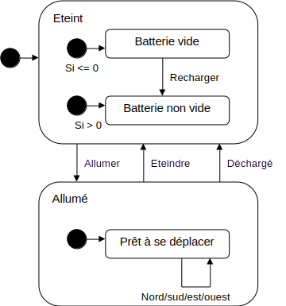

Rapport de Projet\
Intégration d’IHM graphique sur un programme utilisant des statecharts SCXML
==============

**Author: Matschieu**\
**Master informatique, 2010-2011**

# Introduction

Ce projet consiste à se pencher sur la technologie SCXML permettant de décrire des statecharts grâce à l’utilisation du format XML et de la mettre en relation avec l’aspect Interface Homme-Machine (IHM), dans notre cas à travers une interface graphique.

La question qui se pose plus précisément est : *Est-il facile d’intégrer une interface graphique sur un programme s’exécutant à partir de statechart ?*.

Il est donc nécessaire que le programme se découpe en deux parties : un moteur d’interprétation de statechart et l’interface graphique.

La technologie SCXML est aujourd’hui peu utilisée et il n’existe donc que peu d’application fonctionnant sur une base de statechart.
Cependant, la fondation Apache a développé une librairie fournissant un moteur d’exécution de statechart basé sur l’analyse et interprétation de fichier contenant du SCXML tel qu’il est décrit par le World Wide Web Consortium (W3C).
C’est cette librairie que nous avons utilisée pour réaliser ce projet. 

Ce rapport va donc expliquer comment nous avons réussi à répondre à la question évoquée ci-dessus à travers la compréhension de SCXML et l’utilisation de la librairie Apache. Il nous permettra également de dégager les aspects positifs ou négatifs de cette technologie à travers les difficultés que nous avons rencontrées et les solutions qui ont été mises en œuvre.

# 1. Présentation du sujet

## 1.1. Qu’est ce qu’un statechart ?

Un statechart ou diagramme d’état en français est un automate à état fini avec la particularité qu’un état peut lui-même contenir un autre automate à état fini.
Les arcs entre les états représentent des transitions permettant de passer d’un état à un autre lorsque survient un évènement. 


*Exemple de statechart*

D’un point de vue logiciel, un état représente l’état actuel où se trouve le programme. A un état peut être associé un traitement. Ce traitement est lui-même représenté par un sous statechart.

Dans un même état peuvent se dérouler plusieurs traitements en même temps, ceci est également possible avec les statechart. Un même état peut contenir deux sous statecharts qui s’exécuteront en parallèle.


*Exemple de statechart parallèle*

A noter que quelque soit l’état dans lequel on se trouve, un évènement entraîne un changement d’état.
Les statecharts sont notamment utilisés en UML avec un formalisme bien précis.

## 1.2. Application à réaliser

Le but de notre projet était de réaliser une application qui utilise des statecharts pour décrire son fonctionnement tout en réussissant à y intégrer une interface graphique (facilement si possible).
Il est important de comprendre que dans ce travail, le but est de modéliser sous forme de statechart (à travers un fichier XML) tout le traitement afin de n’avoir à coder que l’interface graphique, à condition de trouver un moteur de statechart permettant de ne pas avoir à se soucier de cet aspect (nous développerons cet aspect par la suite).
Par exemple, si une variable doit se trouver dans le programme, avec une valeur évoluant en fonction des états dans lesquels on se trouve (par exemple un compteur de transitions effectuées), cette variable n’apparaîtra pas dans le code source du programme (par exemple du Java) mais uniquement dans le fichier XML. C’est donc dans le fichier XML que la variable sera déclarée, initialisée et incrémentée.
Cet aspect est important et marque l’un des objectifs majeur du projet. En effet, les travaux effectués l’année précédente par des étudiants de notre formation (application de comptage de vote) n’utilisaient que le changement d’état à la réception d’un évènement. Les valeurs des données manipulées (nombre de votes) se trouvaient en mémoire dans le code Java, ceci n’était pas satisfaisant.

Notre programme fait donc office de test pour vérifier les possibilités des statecharts et des solutions existantes à ce sujet (SCXML et librairies Apache par exemple). Ainsi, il est possible une fois le projet terminé d’en tirer des conclusions quant à l’utilisation des statecharts.

Le travail de fond étant posé, il ne restait qu’à trouver la forme, c'est-à-dire quel genre d’application nous allions réaliser pour tester cette technologie et finaliser le projet.
Il nous a été proposé de réaliser une interface graphique permettant de prendre le contrôle d’un petit robot en lui demandant d’effectuer des actions comme par exemple se déplacer.

# 2. Le SCXML

## 2.1. Présentation

Les statecharts définissent des états contenant des transitions, des évènements. Ces états peuvent également contenir des sous états etc.… On imagine donc pouvoir décrire un statechart sous forme de fichier XML. Mais un problème se pose : comment définir un état, uniformiser la notation ou savoir ce qu’il est réellement possible de faire ?
C’est pourquoi, dès 2005, le W3C (World Wide Web Consortium – à l’origine de la standardisation des formats HTML, XML…) a commencé à travailler sur le SCXML (StateChart extensible Markup Language), c'est-à-dire une extension du XML définissant un ensemble de balises et de règles à respecter afin de pouvoir écrire une machine à états permettant d’interpréter n’importe quel type de statechart. 

Depuis 2005, plusieurs améliorations ont été apportées à SCXML par le W3C, il est désormais possible de gérer des structures conditionnelles, avoir un ensemble de variables dont les valeurs peuvent évoluer, avoir des états parallèles, des transitions déclenchées par des évènement ou non… 

## 2.2. Exemple de SCXML

Nous proposons dans cette partie d’illustrer quelques possibilité du SCXML à travers un exemple simple qui nous a permis de découvrir et comprendre le SCXML en début de projet : le ping-pong.
Le programme ping-pong est simple, il s’agit d’un programme pouvant se trouver alternativement dans deux états qui sont ping ou pong.

Pour commencer il faut obligatoirement une balise racine qui est `<scxml>`.
Le nom de l’état est repéré par l’attribut id de la balise `<state>`.  Les balises `<transition>` permettent de préciser les transitions possibles. Le changement d’état se fait grâce à des évènements (attribut `event`) pingtopong ou pongtoping menant respectivement à l’état ping ou pong (attribut `target`). Si l’évènement n’est pas précisé, la transition se fait automatiquement.
A noter l’attribut `initialstate` de `<scxml>` qui précise l’état initial au démarrage (à l’inverse il est possible de préciser un état final).

L’exemple qui suit est le programme le plus simple qu’il est possible de faire pour tester le SCXML avec changement d’état.

```
<?xml version="1.0"?>
<scxml xmlns="http://www.w3.org/2005/07/scxml" version="1.0" initialstate="ping">

<state id="ping">
		<transition event="pingtopong" target="pong" />
</state>

<state id="pong">
		<transition event="pongtoping" target="ping" />
</state>

</scxml>
```
*Ping-pong.xml : SCXML simple (états/transitions)*

Pour mieux visualiser les changements d’état, nous souhaitons afficher un message lorsque nous entrons ou sortons d’un état. Les balises `<onentry>` et `<onexit>` permettent d’effectuer une action respectivement en entrant/sortant d’un état tandis que la balise `<log>` permet d’afficher un message, par défaut,  sur la sortie standard (nous verrons plus tard la réelle utilité de cette balise).

```
<?xml version="1.0"?>
<scxml xmlns="http://www.w3.org/2005/07/scxml" version="1.0" initialstate="ping">

<state id="ping">
		<onentry>
			<log label="'ping'" expr="'Entree dans ping'" />
		</onentry>
		<transition event="pingtopong" target="pong" />
		<onexit>
			<log label="'ping'" expr="'Sortie de ping'" />
		</onexit>
</state>

<state id="pong">
		<onentry>
			<log label="'pong'" expr="'Entree dans pong'" />
		</onentry>
		<transition event="pongtoping" target="ping" />
		<onexit>
			<log label="'pong'" expr="'Sortie de pong'" />
		</onexit>
</state>

</scxml>
```
*Ping-pong.xml : messages de log*

Enfin nous souhaitons ajouter une variable qui va calculer le nombre de transitions effectuées au cours du programme et l’afficher lors de l’entrée dans l’état ping  seulement si cette dernière est égale à 5.
Il faut donc ajouter un datamodel (balise `<datamodel>`) à la racine dans lequel on utilise la balise `<data>` définissant une variable dont le nom est précisé par l’attribut name et la valeur par `expr`. La balise `<assign>` permet d’affecter une nouvelle valeur à une variable, éventuellement à partir d’une opération mathématique (addition, soustraction…).
Le test pour l’affichage se fait avec la balise `<if>` (`<else>` si besoin) dont la condition est précisée par l’attribut `cond`.

```
<?xml version="1.0"?>
<scxml xmlns="http://www.w3.org/2005/07/scxml" version="1.0" initialstate="ping">

<datamodel>
<data name="cpt" expr="0"/>
</datamodel>

<state id="ping">
		<onentry>
			<log label="'ping'" expr="'Entree dans ping'" />
			<if cond="cpt eq 5">
				<log label="'cpt'" expr="cpt"/>
			</if>
		</onentry>
		<transition event="pingtopong" target="pong" />
		<onexit>
			<log label="'ping'" expr="'Sortie de ping'" />
			<assign name="cpt" expr="cpt + 1"/>
		</onexit>
</state>

<state id="pong">
		<onentry>
			<log label="'pong'" expr="'Entree dans pong'" />
		</onentry>
		<transition event="pongtoping" target="ping" />
		<onexit>
			<log label="'pong'" expr="'Sortie de pong'" />
			<assign name="cpt" expr="cpt + 1"/>
		</onexit>
</state>

</scxml>
```
*Ping-pong.xml : variables et conditions*

Nous terminons cet exemple ici, le but n’étant pas de faire un tutorial sur SCXML. Nous avons vu ici les principales balises de base permettant d’effectuer un statechart avec SCXML.

Pour en savoir plus sur SCXML, vous pouvez consulter la documentation du W3C qui explique quelles balises il est possible d’utiliser, comment et ce qu’elles peuvent contenir : [http://www.w3.org/TR/scxml/](http://www.w3.org/TR/scxml/)

## 2.3. Utilisation

Comme nous venons de le montrer, les possibilités de SCXML deviennent donc intéressantes si on peut juste fournir le fichier XML en entrée d’un programme et en récupérer le résultat de l’exécution.
Néanmoins le point faible du SCXML vient du fait qu’il n’existe, à priori, qu’un seul moteur d’exécution développé par la fondation Apache et fourni sous forme de librairie Java.
Nous allons donc étudier la façon dont fonctionne cette bibliothèque avant de l’utiliser.

# 3. La librairie Apache SCXML

## 3.1. Fonctionnement

La fondation Apache a développé une librairie capable d’interpréter des statecharts SCXML respectant les standards définis par le W3C. 

Cette librairie s’appelle Apache Commons SCXML et est développée en Java. Elle fournie l’implémentation d’une machine à états capable d’analyser et interpréter un fichier fournis en entrée contenant le SCXML

Pour ce faire, la librairie fournie une classe abstraite `AbstractStateMachine`. Le développeur a la charge d’étendre cette classe car c’est le point d’entrée du programme (du moins de l’automate). Il faudra ensuite écrire obligatoire des méthodes publiques correspondant à chaque état (le nom de la méthode est le nom de l’état). Ces méthodes seront invoquées lors de l’entrée dans l’évènement associé et permettent d’effectuer un traitement du côté Java.
La classe `AbstractStateMachine` fournie une méthode `fireEvent()` déjà implémentée qui permet de déclencher un évènement (engendrant ainsi, normalement, un changement d’état).

Et voilà, les éléments de base permettant d’exécuter un fichier contenant du SCXML sont ceux cités ci-dessus. Un programme respectant ces quelques règles peut exécuter statechart SCXML, même le plus complexe qui soit (utilisant toutes les possibilités de SCXML).

Si on veut améliorer son programme, on peut également ajouter des implémentations de  `SCXMLListener` permettant d’ajouter un traitement côté Java lors de l’entrée/sortie dans un état. De plus la librairie permet de récupérer les valeurs des variables contenues dans le SCXML, l’état courant…

Voyons comment fonctionne Apache Commons SCXML en détails à travers l’exemple précédent du ping-pong.

## 3.2. Exemple d’utilisation

La dernière et actuelle version de Apache Commons SCXML est la 0.9, pour l’utiliser il faut donc importer la librairie
* commons-scxml-0.9.jar
qui nécessitera d’importer également les librairies suivantes (également développée par la fondation Apache et disponible sur le site) :
* commons-beanutils-1.8.1.jar
* commons-digester-2.0.jar
* commons-el.jar
* commons-jexl-1.1.jar
* commons-logging-1.1.1.jar
* xalan.jar

Une fois ces librairies ajoutées au projet, on peut commencer à écrire la classe `PingPong` qui étend la classe `AbstractStateMachine` :

```
package pingpong;

import org.apache.commons.scxml.env.AbstractStateMachine;

public class PingPong extends AbstractStateMachine {

	public static final String EVENT_PING = "pongtoping";
	public static final String EVENT_PONG = "pingtopong";

	public PingPong() {
		// On charge le fichier SCXML en appellant le 
// super constructeur
		super(PingPong.class.getResource("/xml/pingpong.xml"));
	}

	public void pong() { } // méthode associé à l’état pong du SCXML

	public void ping() { } // méthode associé à l’état ping du SCXML
}
```

*PingPong.java : moteur Java du ping-pong*

On retrouve bien les méthodes `ping()` et `pong()` correspondant aux états du même nom définis dans le SCXML (cf. fichier SCXML définie précédemment).
Les deux attributs statiques ne font que définir les noms des évènements possibles.

Il ne reste qu’à écrire la classe qui va permettre d’envoyer des évènements à la machine. Pour cela on va se contenter d’une petite interface graphique ne contenant que deux boutons permettant de lancer les évènements.

```
package pingpong;

import java.awt.GridLayout;
import java.awt.event.ActionEvent;
import java.awt.event.ActionListener;
import javax.swing.JButton;
import javax.swing.JFrame;

public class PingPongButtonsFrame extends JFrame {

	private PingPong pp;

	public PingPongButtonsFrame(PingPong pp_) {
		this.pp = pp_;

		this.setLayout(new GridLayout(2, 1));

		JButton pongButton = new JButton("Pong");
		JButton pingButton = new JButton("Ping");

		this.add(pongButton);
		this.add(pingButton);

		pongButton.addActionListener(new ActionListener() {
			public void actionPerformed(ActionEvent arg0) {
				pp.fireEvent(PingPong.EVENT_PONG);
			}
		});
		pingButton.addActionListener(new ActionListener() {
			public void actionPerformed(ActionEvent arg0) {
				pp.fireEvent(PingPong.EVENT_PING);
			}
		});

		this.setVisible(true);
		this.setDefaultCloseOperation(EXIT_ON_CLOSE);
		this.pack();
		this.setLocationRelativeTo(null);
	}

	public static void main(String[] args) {
		new PingPongButtonsFrame(new PingPong());
	}

}
```
*PingPongButtonsFrame.java : interface Swing minimale du ping-pong*

Si on exécute, on se retrouve directement dans l’état *ping* (état initial), en cliquant sur le bouton pong, on déclenche donc l’évènement qui va nous envoyer vers l’état *pong*. Les affichages du SCXML se font sur la sortie standard.

## 3.3. Pourquoi avoir choisie cette librairie ?

Un projet associé à la librairie d’apache a retenu notre attention : Scxmlgui. C’est un programme développé en Java qui permet de modéliser graphiquement des statecharts et de les enregistrer sous forme de fichier SCXML. Nous nous sommes demandé si ce programme fournissait également un moteur d’exécution. 
L’auteur du programme, que nous avons contacté, nous a cependant précisé que Scxmlgui ne permettait que de présenter graphiquement le SCXML et qu’aucun moteur n’était associé au programme. Le programme Scxmlgui n’était donc pas exploitable.

Comme nous venons de le voir dans les parties précédentes, l’utilisation de la bibliothèque d’Apache semble relativement simple et de ce fait il est, à priori, possible d’envisager de créer notre programme en le basant sur ce moteur. Ainsi nous n’aurions pas à nous soucier de l’aspect exécution du statechart mais juste la réalisation du fichier SCXML. Il n’y aurait donc qu’à réaliser l’IHM graphique. 
De plus cette librairie étant la seule brique utilisable que nous ayons trouvée, c’était aussi notre seule solution.

La rareté de ce genre de librairie et son utilisation à priori simple nous ont donc conduit à choisir Apache Commons SCXML pour le développement de notre projet.

# 4. Conception du "robot"

## 4.1. Utilité du SCXML

Afin de pouvoir tester correctement les statecharts en SCXML à travers notre "robot", il faut, au moins, pouvoir se trouver dans plusieurs états différents mais aussi pouvoir en changer.

Dans le cas d’un robot il est tout d’abord possible pour lui de se trouver dans l’état éteint ou allumé. Une fois allumé, il peut se déplacer : à droite, à gauche, vers le haut, vers le bas. Chaque déplacement est représenté par une transition.

Pour tester l’exécution d’un SCXML, nous pouvons ajouter des variables, par exemple le niveau de batterie, la position du robot dans son environnement (coordonnées dans un plan 2D) ou encore la taille de cet environnement.
Les valeurs de ces variables seront modifiées en fonction des états. Par exemple à chaque mouvement la batterie perdra de l’énergie et la position du robot sera mise à jour.

Enfin en fonction des valeurs des variables, des changements d’état arbitraires pourront avoir lieu. Ceci permet d’utiliser les structures conditionnelles.
Citons l’exemple d’une batterie vide suite à un mouvement, alors le robot s’éteindra automatiquement sans l’intervention de l’utilisateur (sans batterie, le robot ne peut être allumé). L’utilisateur ne pourra ensuite que recharger la batterie, après quoi il pourra rallumer le robot et le déplacer.

A partir de tous ces éléments, il devient évident que notre programme, dont nous venons de décrire les fonctions, peut reposer sur un modèle de statechart puisqu’il utilise fortement la notion d’état et peut être représenté en SCXML.

## 4.2. Mise en place du SCXML

A partir de ce que nous venons de décrire ci-dessus, nous pouvons donc réaliser la première partie du programme : le fichier SCXML.

Tout d’abord modélisons ce que nous allons écrire en SCXML sous la forme d’un diagramme :


*Diagramme d’état de notre robot*

Ce diagramme représente les actions que nous avons décrites précédemment, voyons maintenant ce qu’il donne en SCXML. Pour plus de clarté, nous présentons ici la représentation graphique du fichier SCXML réalisée à l’aide du programme Scxmlgui dont nous avons déjà parlé, le fichier SCXML textuel (robot.xml) se trouve quant à lui en annexe de ce rapport.



*SCXML du robot (représentation graphique)*

Nous reconnaissons les états/transitions du diagramme précédent cependant on peut noter l’apparition de deux nouveaux états : *offInit* et *onInit*.
Ces deux états ont du être ajoutés pour des raisons de définition du SCXML. En effet, on souhaite, en rentrant dans des évènements, effectuer une transition automatique vers un autre état selon si une condition est remplie ou non. 

C’est le cas lorsqu’on rentre dans l’état éteint (nous l’avons appelé off), on vérifie si la batterie est vide ou non ce qui s’écrit de cette forme en SCXML :

```
<transition target="batteryEmpty" cond="battery eq 0" />
<transition target="batteryOK" cond="battery != 0" />
```
*robot.xml : transitions conditionnelles*

Les états batteryEmpty et batteryOK étant des sous états de off, il faut spécifier quel sera le sous état initial lorsqu’on rentre dans l’état off (ceci se fait avec la balise <initial>). On voudrait donc pouvoir mettre les deux balises comme ceci :

```
<state if="off">
	<initial>
<transition target="batteryEmpty" cond="battery eq 0" />
<transition target="batteryOK" cond="battery != 0" />
</initial>
[...]
```

Or d’après la documentation du W3C, il n’est pas possible de mettre une transition contenant une condition dans la balise `<initial>`.
Il nous faut donc trouver une solution. Cette solution consiste à entrer dans un sous état initial de off qui sera initOff et qui se chargera ensuite de rediriger vers l’état voulu selon la condition. Ceci s’écrit de la sorte :

```
<state id="off">

	<initial>
		<transition target="offInit" />
	</initial>

	<state id="offInit">
		<transition target="batteryEmpty" cond="battery eq 0" />
		<transition target="batteryOK" cond="battery != 0" />
</state>
[...]
```

*robot.xml : entrée conditionnelle dans un sous état*

La même solution a été mise en place pour l’état *allumé* (que nous avons appelé on).

Enfin, une chose qui n’est pas visible sur le diagramme mais qui nécessite d’être abordé est la notion de variable.
Nous définissons ainsi les variables utilisées en SCXML :

```
<datamodel>
	<!-- Niveau de batterie -->
	<data name="battery" expr="50"/>

	<!—Position courante -->
	<data name="posX" expr="50"/>
	<data name="posY" expr="50"/>

	<!-- Taille de l'environnement -->
	<data name="sizeX" expr="100"/>
	<data name="sizeY" expr="100"/>
</datamodel>
```

*robot.xml : datamodel et variables*

Ensuite il ne reste qu’à modifier leurs valeurs. La taille de l’environnement ne changera pas. La position elle sera modifiée de cette façon (cas d’un déplacement vers le bas = sud) :

```
<transition event="moveSouth" target="onInit">
	<assign name="posY" expr="posY - 1" />
</transition>
```
*robot.xml : changement de position*

Nous pensons également à gérer le fait que l’environnement, celui-ci étant un plan 2D, est torique c'est-à-dire qu’il est impossible de sortir du plan (par exemple sur un plan de 10 * 10, si on arrive à la coordonnée (10;5), on revient à la position (0;5)).

```
<state id="position">
	<onentry>
		<if cond="posX &lt; 0">
			<assign name="posX" expr="sizeX - 1" />
		</if>
		<if cond="posX &gt; sizeX - 1">
			<assign name="posX" expr="0" />
		</if>
		<if cond="posY &lt; 0">
			<assign name="posY" expr="sizeY - 1" />
		</if>
		<if cond="posY &gt; sizeY - 1">
			<assign name="posY" expr="0" />
		</if>
</onentry>
[...]
```
*robot.xml : gestion de la toricité de l’environnement*

Le niveau de batterie quant à lui est décrémenté après chaque action ou rechargé de la même manière que nous modifions la position du robot.

## 4.3. Conception du programme

A ce stade, nous possédons le fichier SCXML, il ne reste, pour obtenir un programme fonctionnel (mode console), qu’à implémenter le moteur.
La façon de procéder en utilisant la bibliothèque Apache Commons SCXML (en héritant de la classe `AbstractStateMachine`) a déjà été abordée précédemment et nous ne reviendrons donc pas dessus.

Cependant il est nécessaire de se demander comment le programme pourra par la suite connaître l’état du robot, sa position ou son niveau de batterie.

La solution la plus simple pour connaître son niveau de batterie ou sa position est de créer des getters renvoyant ces informations ce qui n’est absolument pas un problème.
Inutile que la classe possède des attributs pour le niveau de batterie ou la position, la librairie Apache Commons SCXML nous permet de récupérer leurs valeurs à tout moment, un getter seul suffira donc.

```
public int getBatteryLevel() {
	Context ctx = this.getEngine().getRootContext();
	return ((Number)ctx.get("battery")).intValue();
}
```
*RobotStateMachine.java : getter pour obtenir la valeur d’une variable SCXML*

Quant à l’état du robot, il est possible de connaître l’état courant au niveau SCXML dans lequel nous nous trouvons mais ceci n’est pas forcément exploitable (effectuer des tests par exemple pour afficher quelque chose en fonction de l’état du robot).
Etant donné que nous devons ajouter une méthode par état dans le code Java, il est donc possible de maintenir à jour une valeur permettant de connaître l’état du robot (allumé ou éteint). C’est ce que nous avons fait, pour l’état du robot et de la batterie, sous forme d’énumération (classe interne de notre implémentation de  l’`AbstractStateMachine`).

Nous réunissons tous ces éléments au sein d’une classe RobotStateMachine dont voici le diagramme :


*Diagramme de la classe de RobotStateMachine*

Sur ce diagramme n’apparaissent pas les méthodes associées à chaque état afin de l’alléger. D’un point de vue Java, elles ressembleraient à ceci :

```
public void on() {
	this.robotState = ROBOT_STATE.ON;
}

public void off() {
	this.robotState = ROBOT_STATE.OFF;
}
```
*RobotStateMachine.java : mémorisation de l’état courant du robot*

A ce stade, nous avons un moteur d’exécution capable de faire tourner notre robot (celui-ci a été testé par un programme déclenchant une série d’évènements). Il ne manque qu’une manière pour l’utilisateur de déclencher des évènements pour rendre le robot utilisable.
On pourrait envisager un simple prompt en mode console permettant à l’utilisateur de saisir un numéro correspondant à un évènement.
Dans notre cas nous allons désormais greffer sur ce programme une interface graphique qui nous permettra de déclencher des évènements simplement en cliquant sur des boutons.

# 5. Intégration de l’IHM graphique sur le robot

## 5.1. Observer/Observable

Nous allons donc maintenant intégrer sur notre moteur de statechart une interface graphique.
Cette interface graphique devra présenter la position du robot dans un plan 2D, le niveau de batterie restant et une série de boutons permettant de diriger le robot (c'est-à-dire déclencher des évènements).

Commençons par nous intéresser à un composant graphique qui afficherait un panneau noir dans lequel se trouverait un point vert représentant le robot. Comment savoir si le robot s’est déplacé et par conséquent si il faut redessiner le panneau ?

Une première solution pourrait être d’appeler une méthode redessinant le composant en même temps qu’un évènement de déplacement est appelé. Cette solution est peu pratique car elle implique que le panneau soit connu d’un certains nombre d’autres composants. De plus, l’IHM risque de devenir difficilement maintenable.

Une solution plus "propre" est d’utiliser le motif Observer/Observable qui permet à des composants Observer de réagir au moindre changement d’un composant Observable.
Ainsi nous pourrions avoir notre moteur qui serait Observable et chaque composant graphique, tel notre panneau de position du robot, serait Observer.

A chaque évènement déclenché, il suffirait de notifier les Observer (une fois les transitions effectuées) afin de mettre à jour notre interface. Ceci est faisable en surchargeant la méthode `fireEvent()` de `AbstractStateMachine`. Néanmoins, il faut que notre classe `RobotStateMachine` devienne Observable.

Il existe cependant un problème : l’héritage multiple en Java n’est pas possible et la classe `RobotStateMachine` hérite déjà de `AbstractStateMachine`.
Nous n’avons donc pas d’autre choix que de créer une nouvelle classe qui hérite de `Observer` et encapsule une instance de `RobotStateMachine`. Il faut par contre redéfinir chaque méthode définie par la classe encapsulée et leur déléguer ensuite le traitement. Nous appellerons cette classe `Robot`.

Le diagramme suivant illustre la façon dont nous mettons en œuvre notre Observer.


*Diagramme de classes : mise en œuvre de l’Observer*

Il n’est pas nécessaire d’ajouter les méthodes des états du SCXML dans la classe Robot car ces méthodes ne seront appelées uniquement par la méthode `fireEvent()` de la classe `RobotStateMachine` (c'est-à-dire celle de `AbstractStateMachine`), jamais ailleurs. 
A l’inverse les getters seront appelés par l’IHM et nécessitent d’être redéfinis. Leur implémentation est simple et se résume à appeler la méthode du même nom sur l’attribut `stateMachine`.

```
public int getBatteryLevel() {
	return this.stateMachine.getBatteryLevel();
}
```
*Robot.java : "Surcharge" du getter dans l’Observer*

Il ne reste désormais plus qu’à développer les composants graphiques de l’IHM qui seront, pour la plupart, Observable.

## 5.2. Conception de l’IHM

Notre IHM sera uniquement utilisée pour prendre le contrôle du robot et visualiser son état. Ceci se fait en cliquant sur des boutons ce qui a pour effet de rafraîchir la vue. 

Maintenant que nous avons un Observable, nous pouvons envisager de développé notre interface graphique en rendant Observer.
En rendant Observer (de notre robot) les composants graphiques, nous leur donnons la possibilité de se redessiner si une information qu’ils affichent a été modifiée.
Ces mêmes composants ne devront connaître que deux types d’informations : notre robot (machine à états) afin de pouvoir récupérer les valeurs des variables (batterie, position) et les éventuels composants graphiques qui le composent (boutons, labels…).

Notre interface graphique devra donc présenter :
* Une représentation du robot dans son environnement (`ViewRobotPanel`): un simple plan 2D (noir) avec un point correspondant au robot (vert) qui se déplace.
* Une série de boutons permettant d’effectuer les actions possibles : les boutons correspondants à des actions non disponibles sont grisés et désactivés. L’affichage de ces boutons se fera sous forme de barre d’outils (`ToolsBar`) ou d’un simple panneau au milieu de l’interface (`ControlPanel`), cette dernière solution a été prévue mais n’est plus utilisé dans le programme final.
* Un panneau montrant l’état de la batterie de manière textuelle en pourcentage et visuelle à travers un dessin de batterie rempli de vert en fonction du niveau (`StatsPanel` & `BatteryPanel`).
* Une console affichant les messages de log du fichier XML (`ConsolePanel`) : elle sera composé d’une zone de texte dans laquelle apparaîtrons les messages provenant du SCXML (log).
Tous ces composants seront assemblés au sein d’une fenêtre (`RobotFrame`).

Le diagramme de classes suivant montre de manière plus visuelle ces composants.


*Diagramme de classes : interface graphique*

On remarquera que la classe `ConsolePanel` ne connaît aucune instance de notre robot. On se demande alors comment fait-elle pour afficher les messages, penchons nous donc sur cette question.

## 5.3. Le problème des messages SCXML

Dans notre console, nous souhaitons afficher les messages provenant des `<log>` du SCXML.

Comme le précise le nom de la balise, les messages affichés par le SCXML sont bien des messages de log. L’utilité de tels messages est de permettre le débogage du programme en gardant une trace de son exécution, accompagnée de la date, heure…, soit sur un terminal soit dans un fichier (extension .log généralement). La preuve en est que la librairie Apache Commons SCXML utilise une autre librairie Apache Commons Logging permettant la gestion de messages de log.

=> Les messages de log ne sont donc pas prévus à l’origine pour être présentés en tant que tel à l’utilisateur !

Or nous souhaitons le faire pour pouvoir tester malgré tout l’affichage des log dans l’interface graphique.

Pour faire cela, on voudrait pouvoir préciser à la machine à états d’Apache où écrire les messages de log. Nous venons de dire que la librairie Apache Commons Logging était utilisée, il faut donc modifier la référence de `Log` de l’`AbstractStateMachine`. `Log` étant une interface, il n’est pas difficile de créer notre propre implémentation permettant de préciser les messages à afficher (trace, debug, info, warning, erreur) et l’endroit où les afficher. 

Par défaut,  un log est affiché dans un terminal (sortie d’erreur) avec le format suivant :

```
17 janv. 2011 10:11:01 org.apache.commons.scxml.model.Log execute
INFO: 'exemple: exemple de message affiche avec <log>
```
*Affichage d’un message de log par défaut*

Notre implémentation devra donc afficher la même chose mais sans la date et sur la sortie standard. Dans le cas d’un message d’information, la méthode (héritée de Log) de notre classe ressemblera à ça :

```
public void info(Object o) {
	if (this.isInfoEnabled())
		System.out.println("[INFO] " + o);
}
```
*Exemple d’implémentation du log*

Après modification, on s’aperçoit que seul les messages renvoyés par la classe `AbstractStateMachine` sont affichés avec notre implémentation de `Log`. 
La librairie Apache Commons SCXML utilise une classe par balise SCXML : une autre classe `Log` pour `<log>` ou `State` pour `<state>` par exemple.
Pour nous y retrouver nous appellerons `Log1` la classe `Log` de la librairie Apache Commons SCXML et `Log2` l’interface `Log` de la librairie Apache Commons Logging.
Donc d’après les résultats précédents, nous pouvons déduire que `Log1` n’utilise pas la même implémentation de `Log2` que l’`AbstractStateMachine`. Or `Log1` ne possède aucune méthode permettant de modifier son implémentation de `Log2`, ce qui pose problème car ceci ne répond pas à nos attentes.

En consultant le code source de la librairie Apache Commons SCXML, on s’aperçoit que, dans `Log1`, une instance de `Log2` est obtenue par appel à une factory fournie par la librairie (idem pour les autres classes représentant les balises SCXML).

En cherchant dans la documentation de la librairie Apache Commons Logging, on s’aperçoit qu’il est possible de modifier l’instance renvoyée par la factory (pour plus d’information, consultez la documentation de la librairie Apache Commons Logging). Le fichier doit se trouver à la racine du classpath du projet et se nommer `commons-logging.properties`. Son contenu ressemblera à ça :

```
org.apache.commons.logging.Log=org.apache.commons.logging.impl.SimpleLog
```
*commons-loggin.properties : définition du type de Log à utiliser*

En testant à nouveau,  tous les messages sont au format et à l’endroit voulu. Pourtant il reste un problème : si on souhaite rediriger l’affichage dans un label ou une zone de texte (dans notre cas), comment préciser ce composant étant donné que nous n’avons pas accès à la référence de `Log2` ?

Notre réponse, sans être la plus élégante des solutions, est néanmoins simple à mettre en œuvre et se trouve dans les mots clés "*public*" et "*static*".
En effet, en écrivant notre propre implémentation de `Log2`, il nous est possible d’ajouter un attribut, une zone de texte, statique et public. A chaque ajout d’un message de log, celui-ci sera ajouté dans la zone de texte.
Ainsi, dans notre IHM, nous pouvons récupérer la zone de texte, sans connaître aucune référence de `Log2`. Le fait d’être public permet d’accéder depuis l’extérieur à cet attribut et le fait d’être statique permet de le récupérer sans aucune référence à une instance de `Log2`. De plus, on est assuré que tous les messages, quelque soit leur provenance, arriveront dans la même zone de texte.

La classe `StaticTextAreaLog` est notre implémentation de `Log2`. En voici un extrait :

```
public class StaticTextAreaLog implements Log {

	public static JTextArea textArea = new JTextArea();

	public StaticTextAreaLog(String name) { }

	public boolean isInfoEnabled() {
		return true;
	}

	public void info(Object o) {
		if (this.isInfoEnabled())
			textArea.append("[INFO] " + o + "\n");
	}

	[...]
}
```
*StaticTextAreaLog.java : extrait de l’implémentation*

Il ne reste qu’à penser à modifier le fichier commons-logging.properties pour préciser que l’on veut utiliser notre implémentation.

## 5.4. L’affichage de messages, la bonne pratique

Nous venons de voir que l’affichage des messages pour l’utilisateur ne devrait pas être fait à partir de la balise `<log>` dans le SCXML.
Comment effectuer l’affichage d’un message en fonction des évènements donc ?

La réponse est simple, il faut ajouter des listeners à la machine à états. Pour cela il existe une interface `SCXMLListener` qui définit trois méthodes : onEntry(), onExit() et onTransition() appelées respectivement en cas d’entrée, sortie dans un état ou de transition d’un état vers un autre.
Les classes implémentant ce type doivent ensuite être ajoutées à la machine à états. 

L’exemple ci-dessous illustre l’utilisation de listener de la machine à états. Le listener ajouté affichera le nom (l’id du fichier SCXML) de l’état à son entrée, sa sortie et précisera, en cas de transition, l’état de départ et celui de destination.

```
RobotStateMachine stateMachine =
new RobotStateMachine(RobotStateMachine.XML_FILE);

stateMachine.getEngine().
addListener(this.stateMachine.getEngine().getStateMachine(),
new AbstractSCXMLListener() {

public void onEntry(TransitionTarget state) {
				System.out.println("onetry: " + state.getId());
			}

			public void onExit(TransitionTarget state) {
				System.out.println("onexit: " + state.getId());
			}

			public void onTransition(TransitionTarget from,
TransitionTarget to, Transition transition) {
				System.out.println("transition: from " +
from.getId() + " to " + to.getId());
			}

		});
```

*Exemple d’utilisation de SCXMLListener*

Avec cette méthode, il est simple de réaliser ses propres listener affichant des messages dans des composants graphiques. C’est ce genre de méthode qu’il faut utiliser, plus que la solution un peu particulière que nous avons mise en œuvre (mais qui répond cependant à nos besoins).

## 5.5. Notre interface graphique finale

Au final, nous avons :
* Un moteur SCXML
* Une IHM
* Un système d’affichage de logs
Ces éléments, à eux trois, forment l’application que nous souhaitions obtenir en début de projet à savoir une interface graphique permettant de prendre le contrôle de notre robot décrit en SCXML.

Il ne manque qu’à ajouter un point d’entrée au programme qui va initialiser la machine à états et l’interface graphique. Pour cela nous ajoutons une classe `RobotExec` contenant uniquement une méthode `main()` effectuant cela.


*Diagramme de classes : point d’entrée du programme*

L’exécution montre alors notre application SC-Robot dans la fenêtre suivante :


*Interface graphique du programme SC-Robot*

# 6. Bilan sur SCXML et la librairie Apache 

## 6.1. Ajout de fonctionnalités

Notre application étant terminée et en état de fonctionnement, qu’en est-il si nous souhaitons ajouter de nouvelles fonctionnalités au robot ?

Et bien la première étape est de modifier le fichier SCXML en ajoutant/modifiant des états, des transitions ou encore des variables.

Il faut ensuite modifier la classe `RobotStateMachine` afin d’y ajouter les méthodes correspondant à de nouveaux états.
En cas d’ajout d’un getter dans la classe `RobotStateMachine`, il faudra également modifier la classe `Robot` en y ajoutant le getter appelant le getter de la machine à état.

Enfin, dernière étape, il faut ajouter un bouton déclanchant un nouvel évènement si nécessaire.

En résumé, modifier le robot n’est pas réellement compliqué mais cela nécessite quand même quelques changements au niveau du code source Java, on ne peut se contenter de ne mettre à jour que le fichier SCXML en cas d’ajout d’états/transitions.

## 6.2. Le robot sans SCXML

Et sans SCXML, qu’aurait donné le même programme ?

Premièrement, il aurait fallu écrire ce qui est notre actuelle machine à état, c'est-à-dire tout un ensemble de classes génériques permettant de créer des états, d’ajouter un état dans un autre état (récursivité) et de gérer tous les états actuels, les transitions… Rien que cet aspect représente un travail assez considérable. Cependant peut être aurions nous trouvé une bibliothèque permettant de faire cela.

Ensuite il aurait fallut définir tous nos états en héritant de classes et/ou d’interfaces de notre moteur maison. On comprend donc que rajouter un état, une transitions ou n’importe quel autre élément signifierait ajouter une nouvelle classe ce qui est peu pratique.
La partie IHM quant à elle n’aurait sans doute pas été vraiment différente avec les mêmes choses à modifier en cas d’ajout d’un état/transition.

Le fait d’avoir une machine à état capable d’interpréter n’importe quel type de statechart défini en SCXML est donc une force et un avantage considérable puisqu’il y a peu de modification à apporter par la suite mis à part quelques méthodes/boutons dans l’IHM.

Avec le SCXML notre robot est sans doute bien plus évolutif, simple à définir (grâce au XML) et à comprendre.

## 6.3. Autre type d’IHM

Supposons maintenant que l’on veuille ajouter une nouvelle façon d’interagir avec le robot, par exemple par la voix. Est-il simple d’appliquer une nouvelle interface permettant d’envoyer un évènement à partir d’une commande vocale envoyée par l’utilisateur ?

A priori la seule chose dont nous avons besoin c’est la méthode `fireEvent()` de `Robot`. Il semble donc assez simple d’avoir un programme qui reçoit et analyse des sons et en cas de son accepté appelle cette méthode. 

La classe Robot reste de plus toujours Observable et on peut donc imaginer que les Observers seront désormais des composants qui, au lieu de se redessiner en cas de changement, lirons un son qui sera entendu par l’utilisateur.

La réponse est donc qu’effectivement il ne semble pas, à priori, difficile d’interfacer autrement qu’avec une interface graphique notre programme.

# 7. Manuel d’utilisation

## 7.1. Exécution du programme

Nous fournissons notre programme sous forme de JAR exécutable contenant les classes de notre projet, les librairies Apache nécessaires à son exécution, les images pour l’IHM et le fichier SCXML du Robot. Cette archive JAR se nomme `SC-Robot.jar`.
L’avantage de cette archive JAR est qu’il n’y a besoin de rien d’autre, aucune librairie à installer, aucune configuration.

Sous Windows ou MacOS il est possible de lancer l’exécution simplement en double cliquant sur le fichier. Sur un système GNU/Linux, il faut passer par le terminal et lancer la commande
```
javac –jat SC-Robot.jar
```

Le projet NetBeans (car nous avons utilisé NetBeans 6.9.1) est également fourni avec les sources, ressources… Il est donc possible d’exécuter le programme sous NetBeans ou sinon en utilisant Ant en ligne de commande (cf. fichier `build.xml` à la racine du projet) :
```
ant run
```

Si vous souhaitez regénérer l’archive JAR (à la racine du projet) :
```
ant package-for-store
```

## 7.2. Utilisation du programme

Une fois le programme démarré, vous pouvez utiliser les boutons de la barre d’outils pour effectuer des actions. Ces actions ont, pour certaines, un équivalent avec les touches du clavier.

Le tableau suivant  liste les différentes actions possibles, ainsi que l’icône du bouton et la touche associée.

| Icônes | Touches | Actions |
| --- | --- | --- |
|  | Flèche gauche | Se déplacer à l’ouest |
|  | Flèche haut | Se déplacer au nord |
|  | Flèche droite | Se déplacer à l’est |
|  | Flèche bas | Se déplacer au sud |
|  | Touche entrée | Allumer le robot |
|  | Touche entrée | Eteindre le robot |
|  | Touche espace | Recharger la batterie |
|  |  | Affiche un pop up d’aide à propose de l’application |
|  |  | Affiche un pop up d’information "à propos" de l’application |
|  |  | Ferme l’application |

# Conclusion

Pour conclure ce rapport et ce projet, nous pouvons donc dire que nous avons atteint l’objectif fixé au départ qui était de réaliser une application dont tout le traitement serait représenté sous forme de statechart en SCXML.

Contrairement au projet de l’année précédente dont l’aspect statechart ne se limitait qu’à un ensemble d’états et de transitions, nous avons su, dans notre projet, inclure tout le traitement du modèle à travers la gestion du niveau de batterie ou de la position du robot.
Ceci a permis d’utiliser une bonne partie des possibilités offertes par SCXML, de comprendre son fonctionnement et de le mettre en œuvre grâce à la librairie d’Apache.

Mais n’oublions pas non plus l’un des objectifs initiaux qui était de greffer une IHM, interface graphique dans notre cas. Ceci a été réalisé selon un modèle clair grâce au motif Observer/Observable.

Nous pouvons donc dire que la librairie Apache Commons SCXML est performante pour réaliser des applications avec SCXML et y intégrer une interface graphique n’est pas forcément compliqué.
La description d’un statechart avec SCXML est de plus extrêmement simple du fait de l’utilisation du XML alors qu’elle serait bien plus compliquée et moins évolutive en Java.

D’un point de vue personnel, nous avons eu l’occasion de découvrir les statecharts et la façon de les utiliser dans un programme, chose que nous ne connaissions pas.
Le déroulement du projet fut intéressant dans le sens où il y avait l’aspect "tester" une nouvelle technologie pas encore aboutie. Le peu de documentation à ce sujet nous a forcé à comprendre et chercher par nous-même jusqu’à aller observer le code source d’une librairie.

Cependant plusieurs pistes de travail pourrait orienter les futurs projets, par exemple : comment mettre en œuvre un programme utilisant SCXML et capable de sauvegarder l’état, les valeurs des variables, etc.… à un instant t (fin du programme) pour les restaurer ultérieurement (démarrage du programme) ?

# Netographie

* W3C :documentation de SCXML : [http://www.w3.org/TR/scxml/](http://www.w3.org/TR/scxml/) 
* Fondation Apache : Librairie Apache Commons SCXML : [http://commons.apache.org/scxml/](http://commons.apache.org/scxml/)
