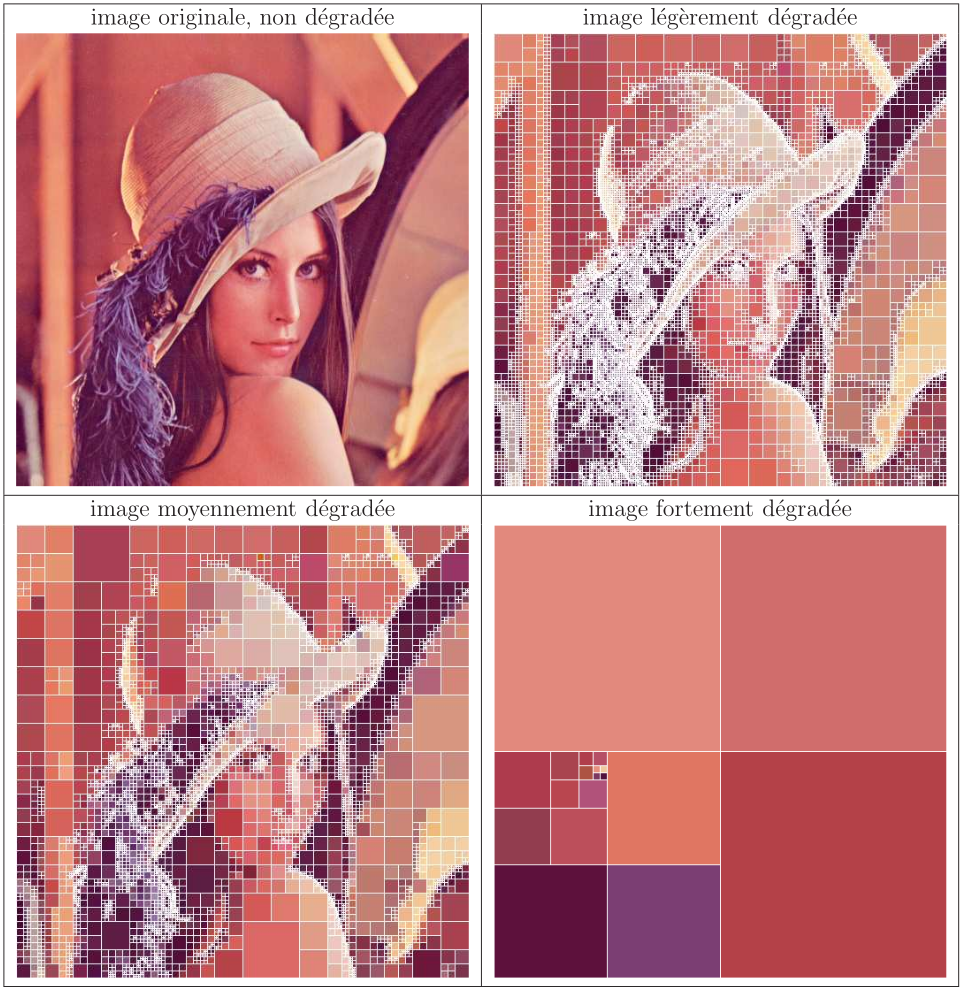
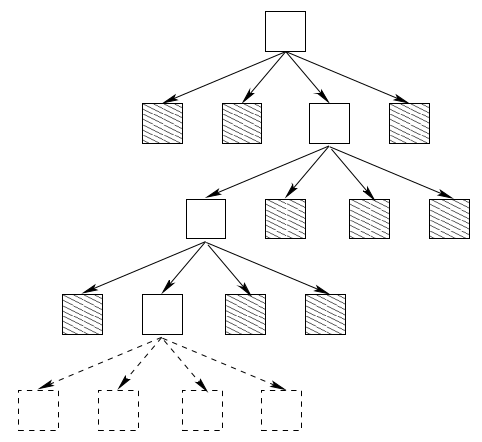

Compression d'image
==============

**Author: Matschieu**

# MAKEFILE

* `make`\
compile l'ensemble des exécutables puis nettoie tous les fichiers .o (appel à make clean).
Attention, il est nécessaire d'avoir la lib de développement X11 installée.
* `make clean`\
permet de nettoyer les fichiers .o.
* `make realclean`\
permet de nettoyer l'ensemble des fichiers .o et les exécutables.
* `make docker`\
démarre une image Docker qui compile le pogramme.
* `make docker-clean`\
permet de nettoyer l'image Docker.

# Sujet

## 1 Présentation du sujet
Le but du projet est de concevoir un programme permettant de compresser et décompresser une image par une méthode dite «destructive».

Le programme devra impérativement fonctionner en ligne de commande seuls les paramètres sur la ligne de commande sont autorisés (aucune interaction directe de type question/réponse avec l'utilisateur n'est autorisée).

Le programme devra également suivre la méthode de compression décrite ci-dessous. On s'autorisera à ne traiter que des images true color dont la taille est 512x512.

## 2 Compression destructive ou «avec pertes»
La méthode de compression considère que si une zone de l'image contient des pixels dont les couleurs sont similaires alors on peut lui attribuer une seule et même couleur.

Dans le cas contraire, c'est-à-dire lorsque la zone présente des couleurs trop différentes, alors on découpe la zone en quatre et on recommence.

C'est le fait d'attribuer une couleur unie à une zone plus ou moins grande de l'image qui va permettre de réduire la quantité d'informations stockées et donc de compresser l'image.

Le critère de «similarité» des pixels d'une zone est la distance maximale entre les pixels de cette zone. Plus cette distance est grande, plus on s'autorisera de grandes variations de couleurs sur une zone donnée et plus on perdra de détails de l'image initiale (voir la figure 1).

*FIG. 1 la même image à différents niveaux de qualité* 

## 3 Utilisation d'un arbre quaternaire
L'image initiale est donc éventuellement subdivisée en quatre sous-images. Chacune de ces sous-images étant également subdivisée si nécessaire et ainsi de suite, l'image peut alors être vue comme un arbre quaternaire dont chaque feuille est une zone non subdivisée à laquelle est donc associée une couleur.

La figure 2 présente une partie de l'arbre de la dernière image avec les feuilles hachurées (et contenant donc une couleur).

*FIG. 2 une partie de l'arbre de l'image fortement dégradée* 

## 4 Stockage des données compressées
Dans les fichiers fournis, le principe adopté pour stocker l'arbre quaternaire consiste à enregistrer:
* pour une feuille un bit à 0 suivi des données true color,
* pour un nœud interne un bit à 1 suivi des données des quatre fils.

Par exemple, l'arbre de la figure 2 serait stocké comme suit:
`10 couleur 0 couleur 110 couleur 1 couleur 0 couleur 0 couleur couleur couleur 0 couleur` 

Il est alors bien évident que les données ne sont pas nécessairement alignées sur les limites d'octets.

## 5 Quelques simplifications
Nous vous fournissons:
* du code C permettant de lire et d'écrire des images au format Targa (.TGA), vous n'avez pas à vous soucier des spécifications de ce format d'images,
* du code C permettant d'ouvrir une fenêtre dans laquelle on peut tracer des pixels de différentes couleurs (utile pour certains tests),
* des images d'exemples (images non compressées, compressées, enregistrées en TGA ou dans notre format propriétaire).